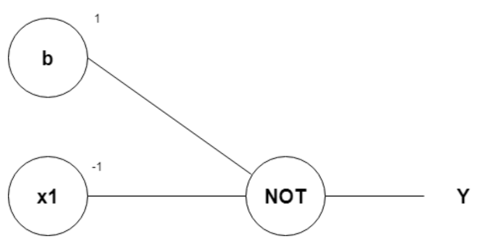
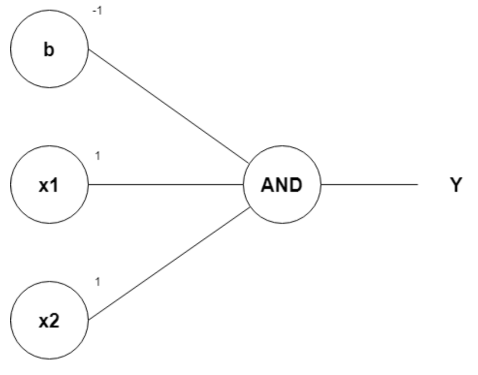
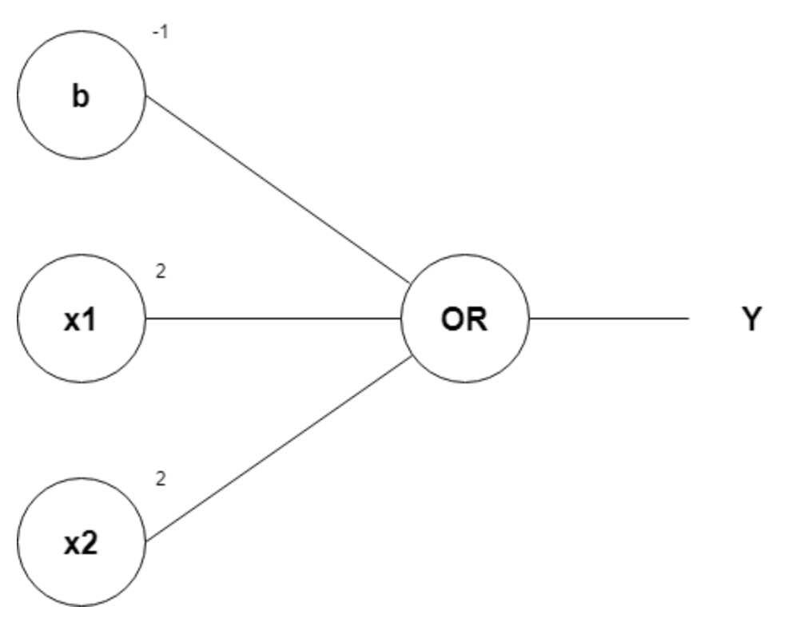
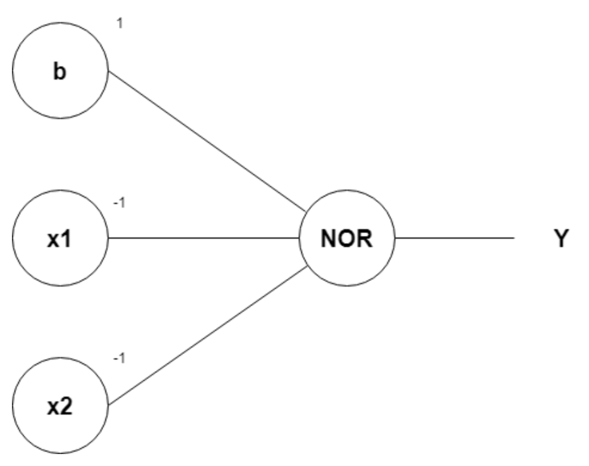
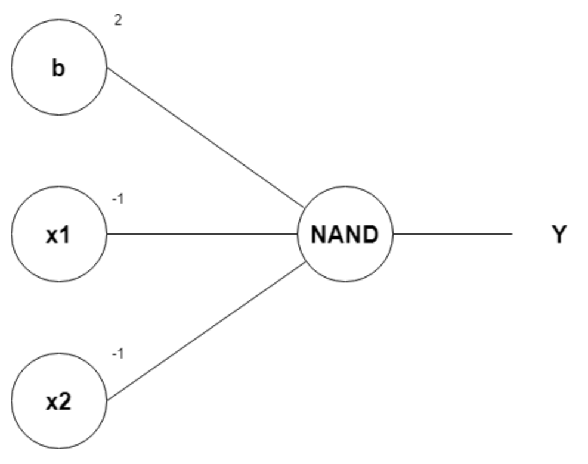
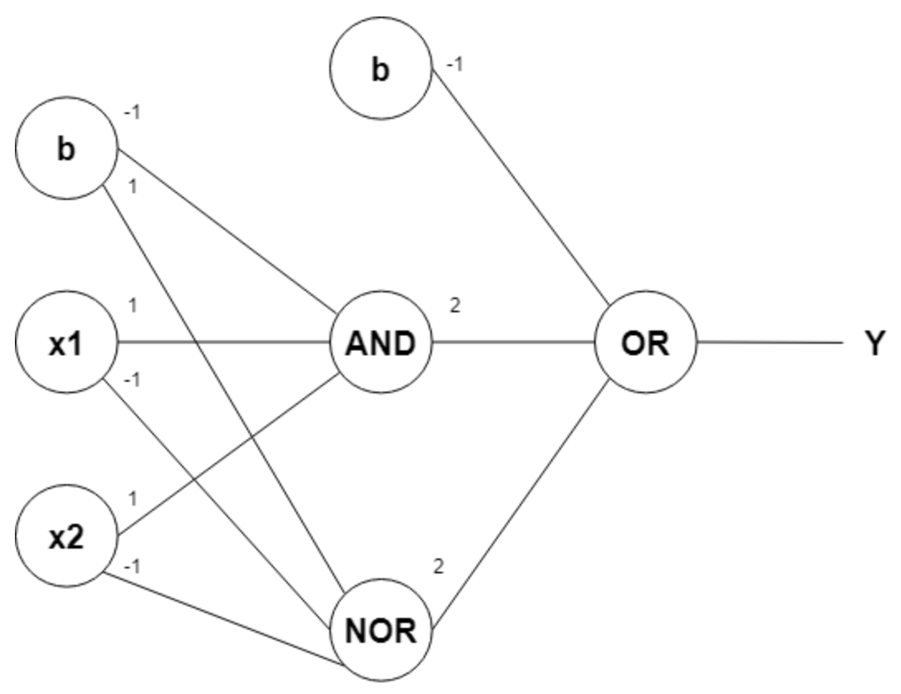
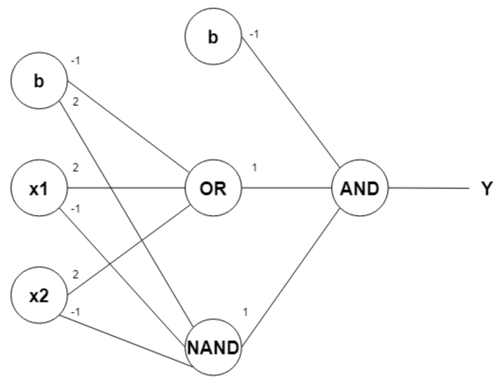
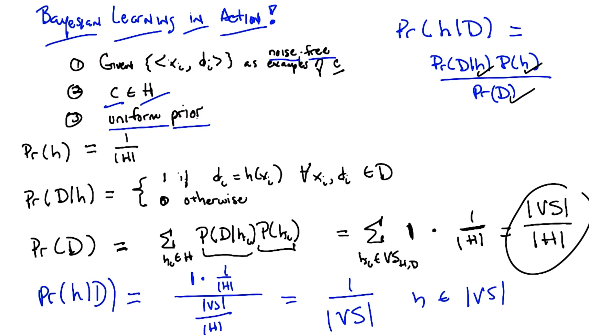
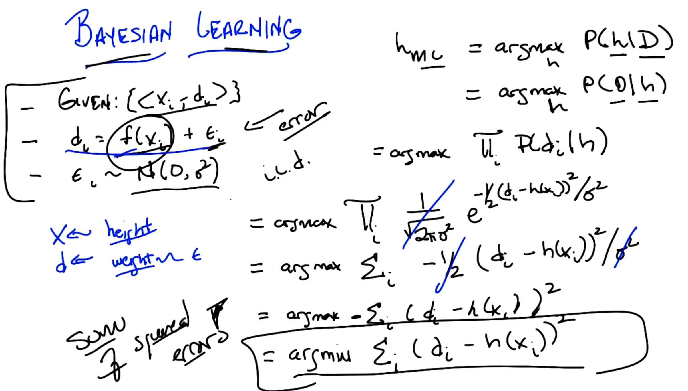
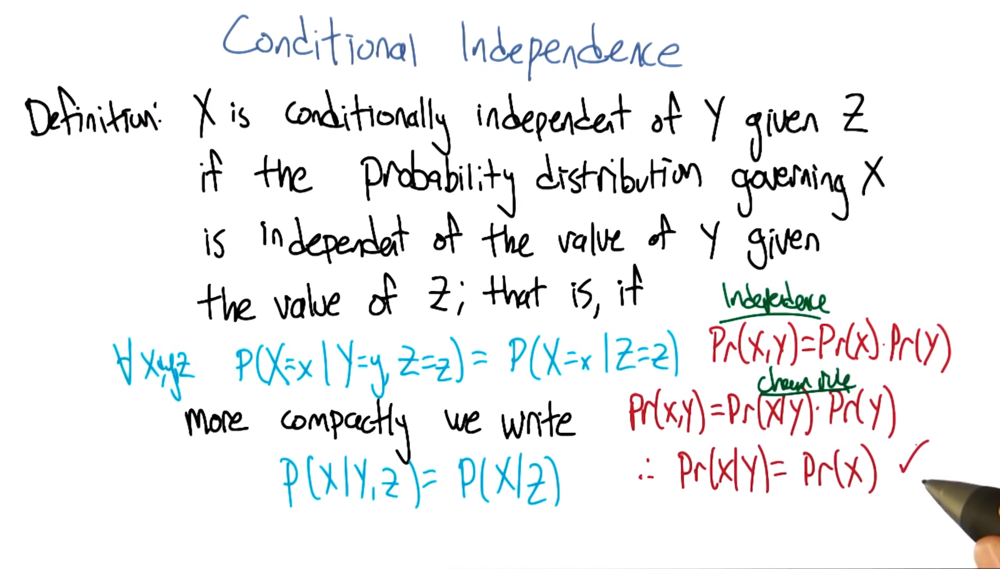

# CS 7641 Machine Learning Midterm Preperation

## Decision Tree

### Decision Tree Expressiveness

The number of nodes needed to represent a relationship that has n attributes

- linear: OR, AND (n nodes for n attirbutes)
- exponential: XOR ($2^n$ nodes for n attributes)

### ID3

Best attribute is based on information gain

$$Gain(S,A)=Entropy(S)-\sum_{v}^{} \frac{|S_{v}|}{|S|}Entropy(S_{v})$$
$$Entropy(S)=-\sum_{v} p(v)logP(v)$$

where A is the attribute and S is the set of training examples, v is the different values the attribute can have

### Inductive/Preference Bias:

- Good split near the top
- Prefers correct ones to incorrect ones
- Prefer shorter trees

### Overfitting

Likely to happen when you put too much trust on the data. The decision tree can get way too complicated and actually performs worse on the testing set.

To stop it with an error threshold:
- Max Depth
- Pruning
- Breadth First Expansion

### DT Regressor

See Problem Set 1 Q4

## Neural Network

Some Neural Network representation of simple logic gates:
- Inverter 
- AND Gate 
- OR Gate 
- NOR Gate 
- NAND Gate 
- XNOR Gate 
- XOR Gate 

### Perceptron Training

$$\Delta \omega _{i} = \eta (t - o)x_{i}$$

where

$$o=\sum_{i}^{}\omega _{i}x_{i} \geq 0$$

### Gradient Descent

$$\Delta \omega _{i} = -\eta \frac{\partial E}{\partial \omega _{i}}$$

where

$$E=\frac{1}{2} \sum_{d \in D}(t_{d}-o_{d})^2$$

where E is also known as the error function and d is each instance in the dataset

for

$$o=\sum_{i}^{}\omega _{i}x_{i}$$

$$\frac{\partial E}{\partial \omega _i}=\sum_{d \in D}(t_{d}-o_{d})x_{di}$$

$$\Delta \omega _{i}=\eta \sum_{d \in D}(t_{d}-o_{d})x_{di}$$

### Comparison between Perceptron Learning and Gradient Descent

- Unlike perceptron training rule which has best performance when the data is linearly separable, gradient descent training rule can model non-linear function.
- To use gradient descent, the output function has to be differentiable.

### Differentiable Threshold Unit in Multi-layer NN

We need a node that has a preceptron-like behaviour and differentiable such as: sigmoid.

$$\sigma (a)=\frac{1}{1+e^{-a}}$$

$$\sigma^{'} (a)=\sigma (a)(1-\sigma (a))$$

Might get stuck in local minima as the complexity goes up. To solve this problem, people uses the momentum algorithm

### Restriction/Preference Bias

NN is not really restrictive. It can represents boolean, continuous and arbitrary functions
Prefer simpler network and correct output

## k-NN

### Restrictive/Preference Bias

- Locality: Near points are similar (Assumption)
	- There is a different similarity assumption within the distance function you choose (e.g. Manhatten vs Euclidian)
- Smoothness: The change is not dramatic
- All features matter equally (Intrinsic to the distance function)

### Curse of Dimensionality

As the number of features or dimensions grow, the amount of data we need to generate accurately grows exponentially.

**Instead of putting equal weights on all inputs, we can put higher weights on nerighbours that are closer and do locally weighted regression/calssification.**

## Boosting / Ensemble Learning

Boosting/Ensemble Learning does most of the computation at query time instead of training time. During training time, it simply stores the data.

### Weak Learner

Model that does better than chance (aka being correct greater than 50% of the time).

A certain weighted distribution of instances in a hypothsis space can cause no weak learner (aka evil distribution)

### Boosting Algorithm

Weak learners will learn about the model first and the distribution of the instances change depending how good the weak learner does on this instance. An error rate that is larger than 50% will be deemed a hard learner and the weight of that instance will increasers and vice versa.

Initial condition:

$$D_{0}(i)=\frac{1}{n}$$

where n is the number of instances

Iterations:

$$D_{t+1}(i)=\frac{D_{t}\cdot e^{-\alpha _{t}y_{i}h_{t}(x_{i})}}{Z_{t}}$$

where $Z_{t}$ is the normanilization coefficient and

$$\alpha _{t}=\frac{1}{2}ln\frac{1-\epsilon _{t}}{\epsilon _{t}}$$

$$H_{final}(x)=sgn(\sum_{t}^{}\alpha _{t}h_{t}(x))$$

**Boosting tends not to overfit as with more and more weak learners, the boosting algorithm gets more confident in the output and increasing the margin which tends to minimize overfitting. In fact the more data you feed the algorithm, the less likely it will overfit.**

## SVM

Maximize the margin $\frac{2}{||\omega ||}$ while classifying everything correctly. However this is hard but we can flip it to a quadratic programming problem where you need to minimize $\frac{1}{2}||\omega ||^2$ or maximizing

$$W(\alpha)=\sum_{i}^{}\alpha _{i}-\frac{1}{2}\sum_{i,j}^{}\alpha _{i}\alpha _{j}y_{i}y_{j}x_{i}^{T}x_{j}$$

where

$$\alpha _{i} \geq \phi, \phi=\sum_{i}^{}\alpha _{i}y_{i}$$

Only a few of x's matter as most of the $\alpha$ in the above equation are 0.

### Kernel

The $x_{i}^Tx_{j}$ from the above equation can be considered as a kernel. In fact that portion of the equation can be substituted with K(x_{i}, x_{j}) where the kernel is subject to the [Mercer Condition](https://en.wikipedia.org/wiki/Mercer%27s_theorem). Essentially it means the kernel has to be distance like.

## Computation Learning Theory

### Version Space

The hypothesis space where it produces the same data label from the same atrribute between the training sample and the true output.

A VS(S) is $\epsilon$-exhausted iff $error_{D}(h) \leq \epsilon\ \forall h \in VS(S)$

### PAC

A Concept Class is PAC Learnable by Learner L using Hypothesis space H if and only if L will, with probability 1-$\delta$, output a hypothesis $g\in H$ such that $error_{D}(h) \leq \epsilon$ in time and samples in $\frac{1}{\epsilon}$, $\frac{1}{\delta}$ and |H|

### Haussler Theorem

For finite Hypothesis Space

$$m \geq \frac{1}{\epsilon}(ln|H|+ln\frac{1}{\delta})$$

where m is the sample size, $\epsilon$ is the error rate and $\delta$ is the confidence rate

## VC Dimension

The largest set of inputs that the hypothesis class can label in all possible ways.

VC Dimension = True # of Parameters

For infinite Hypothesis Space

$$m \geq \frac{1}{\epsilon}(8ln|VC(H)|\cdot log_{2}\frac{13}{\epsilon}+4\cdot log_{2}\frac{2}{\delta})$$

H is PAC learnable iff VC Dimension is finite.

## Baysian Learning / Inference

$h_{ml}=argmax_{h}Pr(D|h)$

$h_{map}=argmax_{h}Pr(h|D)$

Length of a hypothesis = $-lgP(D|h)$

Inferencing Rules:
- Marginalization: $P(x)=\sum_{y}^{}P(x\cdot y)$
- Chain Rule: $P(x\cdot y)=P(x)P(y|x)$
- Bayes Rule: $P(h|D)=\frac{P(D|h)P(h)}{P(D)}$

$$P(V|a_{1},a_{2},...,a_{n})=\frac{\prod_{i}^{}P(a_{i}|V)\cdot P(V)}{Z}$$

where V is the label and a is attribute

Disadvantage:
- One unseen attribute spoils the whole inference.
- Believe your data too much
- Doesn't model interrelationship between attributes
- Inductive Bias

