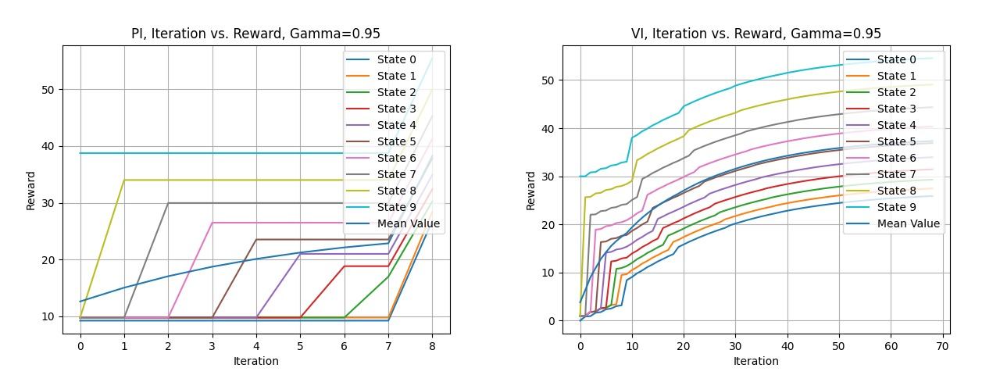
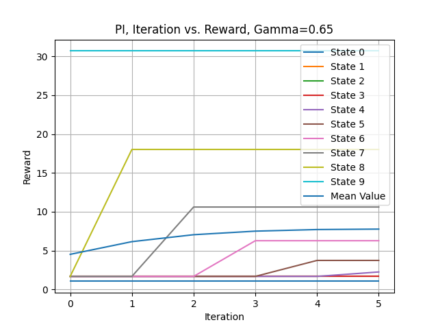
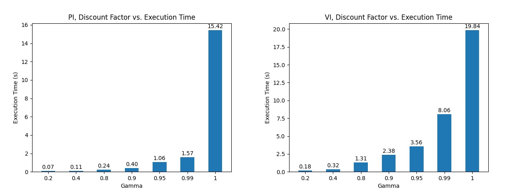
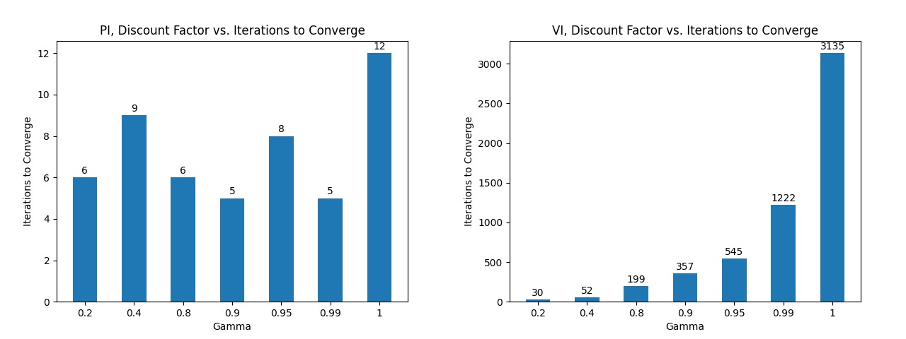
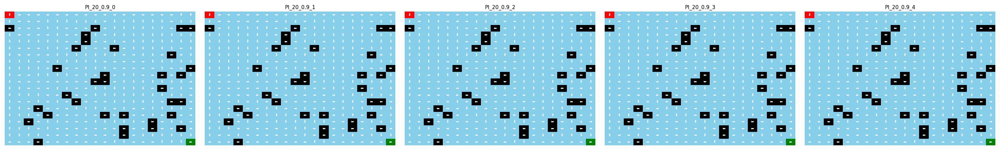
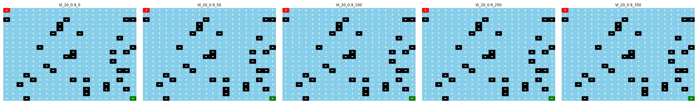
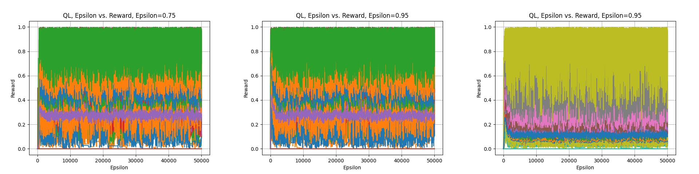

# Makarov Decision Process

## Abstract

In this project, two Markov Decision Processes (MDPs) problems will be solved by 2 algorithms, Value Iteration and Policy Iteration, and one learning algorithm of choice, Q-Learning will be applied to explore the different behaviors of reinforcement learning algorithms with different parameters (e.g. number of states, number of actions, discount factor, learning rate, etc.).

The two MDP problems are Forest Management and Frozen Lake. For those two problems, the question of why it is interesting will first be answered. Following that, some analysis results will be presented.

## Reinforcement Learning Techniques

### Markov Decision Process

Markov Decision Process (MDP) is a mathematical framework for modeling decision making process. It is a 5-tuple $\langle S, A, P, R, \gamma \rangle$, where $S$ is the set of states, $A$ is the set of actions, $P$ is the transition probability, $R$ is the reward function, and $\gamma$ is the discount factor. The discount factor $\gamma$ is used to measure the importance of future rewards and is bounded in the range of [0, 1]. When $\gamma$ is 0, the agent only cares about the immediate reward, while when $\gamma$ is 1, the agent cares about the future rewards infinitely.

With the MDP, the agent can make decisions based on the current state and the reward it gets from the environment. The agent will choose the action that maximizes the expected future reward, calculated by the Bellman equation.

### Value Iteration

Value iteration (VI) is an algorithm to solve MDPs. It is a dynamic programming algorithm that iteratively updates the value function of each state, until the value function converges. It is an off-policy algorithm, meaning that it does not require to follow the policy being evaluated. The value function of each state can be calculated by the Bellman optimality equation:

$V_{k+1}(s) = \max_{a} R(s, a) + \gamma \sum_{s'} P(s'|s, a) V_k(s')$

### Policy Iteration

Policy iteration (PI) is also an algorithm to solve MDPs. It is a dynamic programming algorithm that iteratively updates the policy until the policy converges. It is an on-policy algorithm, meaning that it requires to follow the policy being evaluated. The policy can be updated by the Bellman optimality equation: $Q_{k+1}(s, a) = R(s, a) + \gamma \sum_{s'} P(s'|s, a) V_k(s')$

Although the principle that VI and PI follow are similar, the key difference between them is that VI only extract the policy from the value function once, when the value function converges whereas PI extracts the policy from calculated value function (argmax) every iteration which guarantees improvement from iteration to iteration.

### Q-Learning

Q-learning (QL) is a model-free reinforcement learning algorithm, meaning that it does not require a model of the environment. It is an off-policy algorithm, meaning that it does not require to follow the policy being evaluated. The Q-value of a state-action pair can be calculated by the Bellman equation: $Q_{k+1}(s, a) = (1-\alpha) Q_k(s, a) + \alpha \left[R(s, a) + \gamma \max_{a}\right]$ where $\alpha$ is the learning rate. QL has the problem of falling into local minimum when there are multiple minima. To address this, greedy rate $\epsilon$ is introduced to balance the trade-off between exploration and exploitation. Just like simulated annealing, $\epsilon$ decays every iteration and determines if the agent will exploit the current value function information to infer the best policy or a random action will be selected for exploration.

## Forest Management

### Introduction

The MDP Problem has $n$ states, $S_0, S_1, S_2,...,S_{n-1}$, where each state represents the age of the forest and two actions: 'Wait' (0) and 'Cut' (1). The objective of forest management is to a) maintain an old forest for wildlife and b) to make money selling cut wood. Each year there is a probability $p$ that a fire burns the forest. For states other than $S_{n-1}$, action 'Wait' will not yield any reward, but action 'Cut' will reward 1 point. For $S_{n-1}$, action 'Wait' will reward $r_1$ points and action 'Cut' will reward $r_2$ points. $r1$ and $r_2$ are strictly positive.

### Value Iteration & Policy Iteration

The MDP is first configtured with $S=10$, $r1=4$ and $r2=30$, that is there are 10 states in total, the reward for waiting in the last state is 4 and the reward for cutting in the last state is 30. The discount factor $\gamma$ is set to 0.95. The transition probability $P$ is set to 0.1 by default. Convergence for VI is defined as such that the difference between the value function of the current iteration and the previous iteration is less than $\epsilon \cdot \gamma \cdot (1-\gamma)=0.01*0.05/(1-0.05)=5.26312\cdot 10^{-3}$.

Figure 3.1 shows the change of the value function for each state as the iteration progresses for both PI and VI. For PI, converge happens at iteration 9 and for VI, convergence happens at iteration 69. This supports the observation that PI usually takes less iterations to converge than VI as it takes larger step when iterating in the policy space which guarantees improvement between iterations. The "larger" step is also reflected in the smoothness of the curve. The curve for VI is a lot smoother than that of PI indicating a smaller step interval. However, from the [VI log](./assets/forest/VI_Policy_Migration_10_4_30_0.95.txt), it is interesting to see that the policy extracted from the value function hasn't changed since iteration 8. That shows that to some extent value iteration is less efficient than policy iteration as the majority of the work is for approaching the most optimal value function rather than the policy. After all, value function is just a means to achieve the optima, not the goal itself. Something else that is worth noticing is those large jumps in both diagrams. They both happen when the value function reaches approximately the same value. It almost feels like VI will take several iterations to build up to a major change but PI changes the same amount in one iteration.

The total CPU time for both PI and VI are similar, both hovering around 2ms. This indicates that although PI takes less iteration, every iteration is more expesive computationally.

The graph also depicts the "ripple" effect of states that has a larger reward (sometimes it's the goal). At iteration 0, the reward for all states is 9.75 except for the last state which has the reward of 38.75. This number is determined by the value function initialization. With the current implementation, this is calculated assuming that the discount factor is 0. As the iteration progresses, the value of each state starts to increase as well starting from the state that are closest to the last state.

This phenomenon is particularly obvious here due to the fact that the last state has a predominantly larger benefit than any other state and $\gamma$ in this configuration is also a large number. This means that the agent will care about future reward indefinitely. When $\gamma$ is smaller, as shown in Figure 3.2 where $\gamma=0.65$, the pattern is still observable but less intense.

| $\gamma$ | State 0 | State 1 | State 2 | State 3 | State 4 | State 5 | State 6 | State 7 | State 8 | State 9 |
|:--------:|:-------:|:-------:|:-------:|:-------:|:-------:|:-------:|:-------:|:-------:|:-------:|:-------:|
| 0.05     | 0       | 1       | 1       | 1       | 1       | 1       | 1       | 1       | 0       | 1       |
| 0.15     | 0       | 1       | 1       | 1       | 1       | 1       | 1       | 1       | 0       | 1       |
| 0.25     | 0       | 1       | 1       | 1       | 1       | 1       | 1       | 0       | 0       | 1       |
| 0.35     | 0       | 1       | 1       | 1       | 1       | 1       | 1       | 0       | 0       | 1       |
| 0.45     | 0       | 1       | 1       | 1       | 1       | 1       | 0       | 0       | 0       | 1       |
| 0.55     | 0       | 1       | 1       | 1       | 1       | 0       | 0       | 0       | 0       | 1       |
| 0.65     | 0       | 1       | 1       | 1       | 0       | 0       | 0       | 0       | 0       | 1       |
| 0.75     | 0       | 1       | 0       | 0       | 0       | 0       | 0       | 0       | 0       | 1       |
| 0.85     | 0       | 0       | 0       | 0       | 0       | 0       | 0       | 0       | 0       | 1       |
| 0.95     | 0       | 0       | 0       | 0       | 0       | 0       | 0       | 0       | 0       | 1       |

Table 3.1 above captures how the policy changes as $\gamma$ increases. The policy is represented by a 1-D array where each element represents the action for each state. The policy for $\gamma=0.05$ is to cut at every state except for state 8 and state 0. As $\gamma$ increases, the policy becomes more conservative and only cuts at the last state. This is becasue when $\gamma$ is close to 0 , the agent will try to maximize the immediate reward. In this case, for State 1-7, the only way to earn reward is to cut. For State 8, the situation is a bit different. Although the agent will only receive 0.05 of the utility for cutting when reaching next state, it's still better than the 1-point reward when cutting right now. As a result, the agent chooses to wait at State 8. As $\gamma$ increases, the agent will care more about future reward and is more likely to wait until the last state to earn the big bonus.

However, the results changed when the reward for cutting in the last state is reduced to 2 and the reward for waiting in the last state is increased to 10. Table 3.2 below shows the policy for different $\gamma$.

| $\gamma$ | State 0 | State 1 | State 2 | State 3 | State 4 | State 5 | State 6 | State 7 | State 8 | State 9 |
|:--------:|:-------:|:-------:|:-------:|:-------:|:-------:|:-------:|:-------:|:-------:|:-------:|:-------:|
| 0.05     | 0       | 1       | 1       | 1       | 1       | 1       | 1       | 1       | 1       | 0       |
| 0.15     | 0       | 1       | 1       | 1       | 1       | 1       | 1       | 1       | 0       | 0       |
| 0.25     | 0       | 1       | 1       | 1       | 1       | 1       | 1       | 1       | 0       | 0       |
| 0.35     | 0       | 1       | 1       | 1       | 1       | 1       | 1       | 0       | 0       | 0       |
| 0.45     | 0       | 1       | 1       | 1       | 1       | 1       | 1       | 0       | 0       | 0       |
| 0.55     | 0       | 1       | 1       | 1       | 1       | 1       | 0       | 0       | 0       | 0       |
| 0.65     | 0       | 1       | 1       | 1       | 0       | 0       | 0       | 0       | 0       | 0       |
| 0.75     | 0       | 1       | 0       | 0       | 0       | 0       | 0       | 0       | 0       | 0       |
| 0.85     | 0       | 0       | 0       | 0       | 0       | 0       | 0       | 0       | 0       | 0       |
| 0.95     | 0       | 0       | 0       | 0       | 0       | 0       | 0       | 0       | 0       | 0       |

The first notable change is that for all values of $\gamma$, the agent chooses to wait for State 9. This makes sense since the reward for waiting outweighs that of cutting. The second difference is the policy for State 8. Unlike in the previous configuration where the agent choice is consistent with different $\gamma$ value, the agent has a different policy mapping when $\gamma=0.05$. This is because the reward for waiting at State 9 is not large enough to outweigh the reward for cutting at State 8. If the reward is increased to 30 just like the previous configuration, the agent will choose to wait for State 8 as well. This detail here shows how the agent's policy is affected by the reward structure.

To explore the effect of the number of states on the agent's policy for both PI and VI, the configuration is changed again with number of states increasing from 10 to 1000.

Figure 3.3 shows the trend of value function of each state with respect to iteration. For PI, the algorithm converges at iteration 14 and for VI, the algorithm converges at iteration 50. For PI, the algorithm takes more iterations. This is likely because with more states, it takes more iterations to fully propoogate the reward to all other states. For VI, the algorithm takes less iterations. This is likely due to the convergence threshold which allows the algorithm to stop early if small changes are still made between iterations. If the threshold is lower, VI should take more iterations to converge.

### Q-Learning

Just like in Simulated Annealing, $\epsilon$ is introduced here to balance the trade-off between exploration and exploitation. The $\epsilon$ value is decreased geometrically over iteration to encourage the agent to exploit more and more as it learns more about the environment.

Figure 3.4 captures how the the value function changes with respect to iteration for the two extreme $\epsilon$ values. The curve converges really quickly in the left plot where $\epsilon=0.05$ because a lower $\epsilon$ value means the agent will exploit more. The curve in the right plot where $\epsilon=0.95$ converges slower because the agent will explore more due to the fact that the agent will choose a random action with a probability of $\epsilon$.

Overall, Q-Learning actually performs a lot worse than PI & VI. Although the number of iteration is set to 1,000,000, Q-Learning hardly reaches the most optimal policy mapping according to the result of PI & VI and this is under the configuration where the learning rate $\alpha$ is set to 1 with a decaying rate of 0.99 and $\epsilon$ is set to 0.95 with a decaying rate of 0.999.

One possible reason is that the random seed that is chosen here just happen to generate some erratic data, but another reason that is more likely is that the reward structure is not designed well. The reward for most states (all states except the last state) are exactly the same and there is only 1 way the "ripple" effect can prorogate (i.e. $S_{n-1} \Rightarrow S_{n-2} \Rightarrow ... \Rightarrow S_0$). This is particularly harsh on Q-Learning as it does not and can not take advantage of the exploitation aspect of Q-Learning to find the best action. This can partially explain why Q-learning is updating the Q-value and is heading the correct direction but in a very slow fashion as shown in the [log](./assets/forest/QL_Epsilon_Policy_Migration_10_4_30_0.95.txt).

## Frozen Lake

### Introduction

The Frozen Lake environment is a grid which contain four possible areas — Safe (S), Frozen (F), Hole (H) and Goal (G). The size of the map is customized for this paper. The agent moves around the grid until it reaches the goal or the hole. The agent in the environment has four possible moves — Up, Down, Left and Right. If it falls into the hole, it has to start from the beginning and is rewarded the value 0. The process continues until it learns from every mistake and reaches the goal.

### Value Iteration & Policy Iteration

The comparison between PI and VI for the frozen lake problem largely follows what has been described in the forest management problem. However, with a lot larger state space and its grid world nature, some more conclusion can be drawn here.

Figure 4.1 captures the execution time of PI and VI with respect to $\gamma$ where the relationship can be modeled as an exponential equation. This observation largely follows the iteration vs $\gamma$ plot in Figure 4.2. This is largely due to the fact that a large discount factor means the agent will care more about the future reward indefinitely and thus it takes a lot longer for the reward at the goal to propagate to the rest of the states.

Since the frozen lake problem is a grid world, it's a lot easier to visualize.

Figure 4.3 and 4.4 captures how the policy changes as the algorithm progresses for both PI (top) and VI (bottom). It again depicts the fact that PI takes larger steps and less iterations in the policy space to achieve the optimal policy mapping.

### Q-Learning

Q-Learning is still the slowest to converge among the 3 algorithms. For the frozen lake problem, the convergence trend is so weak so that when epsilon is less than 0.75 for map size 64 and 0.95 for map size 20, the policy extracted doesn't even change after 50000 episodes. This is also manifested through the average Q-value vs episode plot as shown in Figure 4.5.

As shown in the figure, the Q-value has a lot of variance from iteration to iteration. This can be explained by the exploring behavior of the algorithm.

Another explanation of this behaviour is overestimation which occurs when rewards are awarded stochastically. The larger the variance of these stochastic rewards, the more severe the overestimation. So when there is a specific problem where good states have stochastic rewards with large variance and bad states do not, the bias does indeed improve performance compared to an unbiased algorithm. That is the nature of being biased: in situations where one is correct one is more correct, and in situations where one is wrong one is more wrong. This can also be backed up by the fact that with a smaller state space (64 states in this case), the lower the epsilon value can get where exploitation is more encouraged. This problem may be mitigated through some non-zero reward for the vast majority of states.

Although not enough information is gathered to make a conclusion, some observation on how epsilon affects the behavior of the Q-learning algorithm can still be discussed. A lower $\epsilon$ value means a higher chance of exploitation. Since the reward and the Q-value for all state-action pair are 0 at the beginning, exploitation doesn't really help here as there isn't really much to exploit. However, the $\epsilon$ increases or a higher chance of exploration is encouraged, a much larger progress can be made.

A more thorough run was conducted with all different combincation of $\epsilon$, $\epsilon$-decay, $\gamma$ and $\alpha$ values[1]. The result is shown in [10*10 Frozen Lake](./assets/frozen_lake_grid.csv) and [20*20 Frozen Lake](./assets/large_frozen_lake_grid.csv) and the only finding here is that initializing the Q-table with a non-zero value can help the algorithm converge faster and mitigate this problem.

## Reference

[1] Source code from https://github.com/cmaron/CS-7641-assignments/tree/master/assignment4
