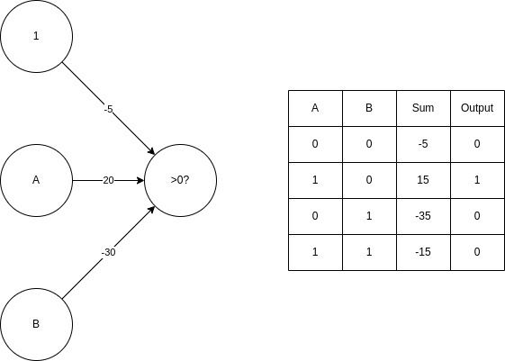
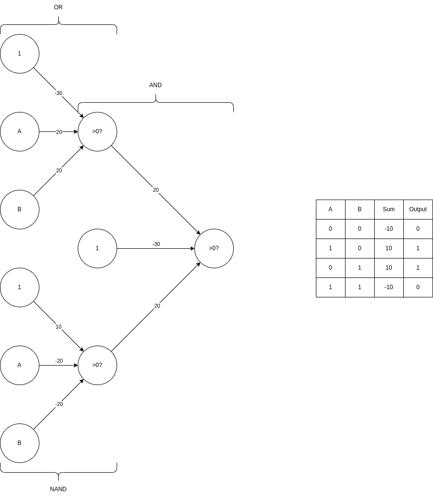

# Problem Set 1 -- Zixuan Kang -- 903404772

## 1. Where we are doing supervised learning, we have mostly assumed a deterministic function. Imagine instead a world where we are trying to capture a non-deterministic function. In this case, we might see training pairs where the x value appears several times, but with different y values. For example, we might use attributes of humans to the probability that they have had chicken pox. In that case, we might see the same kind of person many times but only sometimes they may have had chicken pox. We would like to build a learning algorithm that will compute the probability that a person has chicken pox. So, given a set of training data where each instance is mapped to 1 for _true_ or 0 for _false_:

### 1) Derive the proper error function to use for finding the ML hypothesis using Bayes’ Rule. You should go through a similar process as the one used to derive least squared error in the lessons.

$$P(D|h) = \prod_{i=1}^mP(x_i,d_i|h)=\prod_{i=1}^mP(d_i|h,x_i)P(x_i)=\prod_{i=1}^mh(x_i)^{d_i}(1-h(x_i))^{1-d_i}P(x_i)$$

$$h_{ML}=argmax\prod_{i=1}^mh(x_i)^{d_i}(1-h(x_i))^{1-d_i}$$

Take natural log on both sides, we get:

$$h_{ML}=argmax\sum_{i=1}^mln(h(x_i))d_i+ln(1-h(x_i))(1-d_i)$$

$$\frac{\partial (\sum_{i=1}^mln(h(x_i))d_i+ln(1-h(x_i))(1-d_i))}{\partial \omega_{jk}} = \sum_{i=1}^m\frac{\partial (ln(h(x_i))d_i+ln(1-h(x_i))(1-d_i))}{\partial h(x_i)}\frac{\partial h(x_i)}{\partial \omega_{jk}}=\sum_{i=1}^m\frac{d_i-h(x_i)}{h(x_i)(1-h(x_i))}\frac{\partial h(x_i)}{\partial \omega_{jk}}$$

$$\therefore \Delta \omega_{jk}=\eta \sum_{i=1}^m\frac{d_i-h(x_i)}{h(x_i)(1-h(x_i))}\frac{\partial h(x_i)}{\partial \omega_{jk}}$$

### 2) Compare and contrast your result to the rule we derived for a deterministic function perturbed by zero-mean gaussian noise. What would a normal neural network using sum of squared errors do with these data? What if the data consisted of x,y pairs where y was an estimate of the probability instead of 0s and 1s?

## 2. Design a two-input perceptron that implements the boolean function $A \cdot \bar{B}$. Design a two-layer network of perceptrons that implements $A \oplus B$ (where $\oplus$ is XOR).

{width="50%"}
{width="50%"}

## 3. Derive the perceptron training rule and gradient descent training rule for a single unit with output $o$, where $o=\omega _0+\omega _1x_1+\omega _1x_1^2+...+\omega _nx_n+\omega _nx_n^2$. What are the advantages of using gradient descent training rule for training neural networks over the perceptron training rule?

For the perceptron training rule, $\Delta \omega _i = \eta (t - o)x_i$

For the gradient descent rule, $\Delta \omega _i = -\eta \frac{\partial E}{\partial \omega _i} = -\eta \frac{\partial \frac{1}{2} \sum_{d \in D}(t_d - o_d)^2}{\partial \omega _i} = -\eta \sum_{d \in D}(t_d-o_d)\frac{\partial (t_d - o_d)}{\partial \omega _i} = -\eta \sum_{d \in D}(t_d-o_d)(-x_{di}-x_{di}^2)$

$\therefore \Delta \omega _i = \eta \sum_{d \in D}(t_d-o_d)(x_{di}+x_{di}^2)$

Unlike perceptron training rule which has bets performance when the data is linearly separable, gradient descent training rule can model non-linear function. With the output function in the prompt, it's a non-linear function and gradient descent will have a better performance here.

## 4. Explain how one can use Decision Trees to perform regression? Show that when the error function is squared error that the expected value at any leaf is the mean. Take the Boston Housing dataset (http://lib.stat.cmu.edu/datasets/boston) and use Decision Trees to perform regression.

1. Start with a single node containing all points. Calculate the mean and squared error.
2. Find the next best split, that will reduce S as much as possible. If you reach a stopping criterion, then stop.
3. For every new node, go to step 1.

Here stopping criterion could be specified by specifying a lower bound on the number of data points in a leaf or specifying an upper bound on the error in each leaf.

## 5. Suggest a lazy version of the eager decision tree learning algorithm ID3. What are the advantages and disadvantages of your lazy algorithm compared to the original eager algorithm?

## 6. Imagine you had a learning problem with an instance space of points on the plane and a target function that you knew took the form of a line on the plane where all points on one side of the line are positive and all those on the other are negative. If you were constrained to only use decision tree or nearest-neighbor learning, which would you use? Why?

k-NN will be better. Decision tree will need to separate a linear function into a set of step functions whereas with sufficient amount of data, k-NN can learn a linear function and represent each side with just 1 point.

## 7. Give the VC dimension of these hypothesis spaces, briefly explaining your answers:

### 1) An origin-centered circle (2D)

The VC dimesion of a circle is 2. Since the circle is origin-centered, then the only parameter in this hypothsis is just the radius. With the relationship, VC Dimension = # of parameters + 1, the VC dimension of this hypothesis is 2. Looking at it in another way, if we have 3 dots (d1, d2 and d3) that have distance r1, r2 and r3 from the center of the circle respectively and has a relationship of r1 <= r2 <= r3, there is no way to classify d1 and d3 as positive and d2 as negative (or vice versa). So the VC dimension is 2.

### 2) An origin-centered sphere (3D)

Same reason as above, the VC dimension of a origin-centered sphere is 2.
