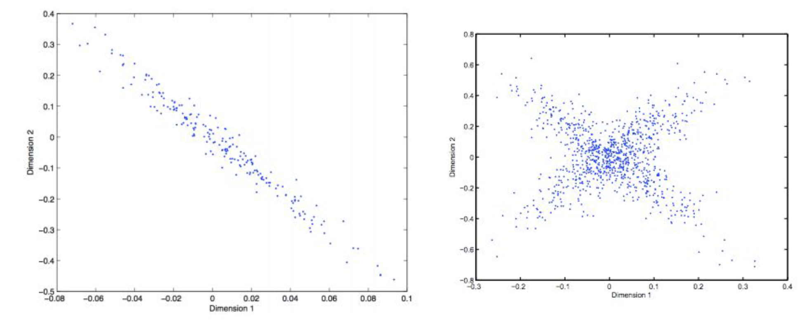
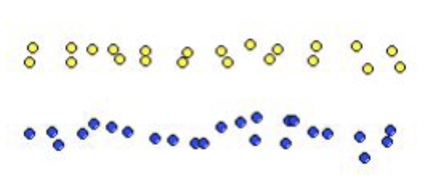
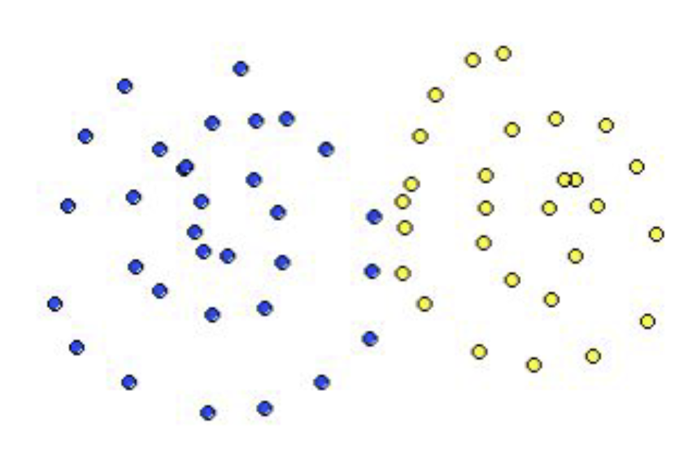
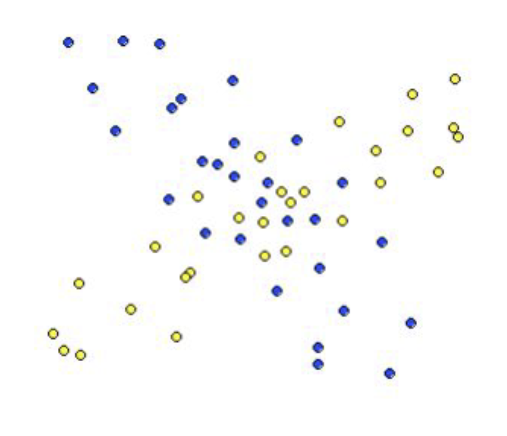
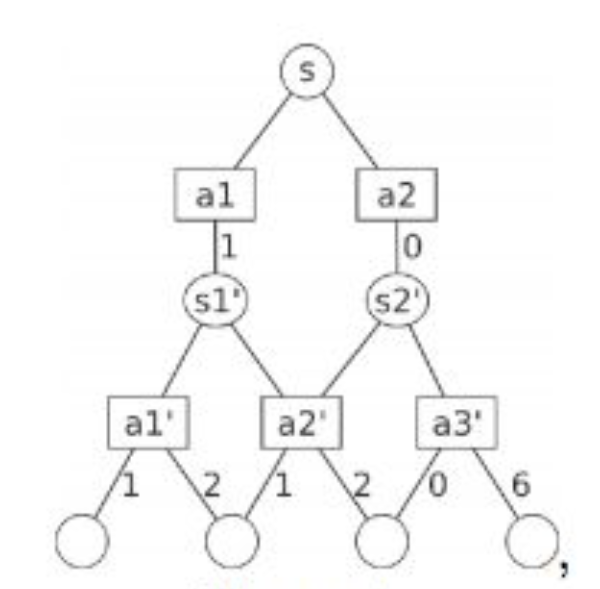

# Problem Set 2 -- Zixuan Kang --903404772

## 1. You have to communicate a signal in a language that has 3 symbols A, B and C. The probability of observing A is 50% while that of observing B and C is 25% each. Design an appropriate encoding for this language. What is the entropy of this signal in bits?

Entropy is calculated as $H=\sum p\cdot log_2\frac{1}{p}$. We know that p(A)=0.5, p(B)=0.25, p(C)=0.25

$\therefore H=\frac{1}{2}log_2{2}+\frac{1}{4}log_2{4}+\frac{1}{4}log_2{4}=1.5$

The encoding system will be A = 0, B = 10, C = 11

## 2. Show that the K-means procedure can be viewed as a special case of the EM algorithm applied to an appropriate mixture of Gaussian densities model.

K-Means is really a special case of the EM algorithm where the hidden variables $Z_n \in {0, 1}$, which means no any sort of softening or probabilistic definition of clusters.

When $Z_n \in {0, 1}$, the equation will end up like this:

$E[Z_{ij}] = \frac{P(x=x_i \| \mu = \mu_j)}{\sum_{i}^{k} P(x=x_i \| \mu = \mu_j)} \leftrightarrows \mu_j = \frac{\sum_i E[Z_{ij}]x_i}{\sum_i E[Z_{ij}]}\ E[Z_{ij}] \in {0,1} \leftrightarrows \mu_j = \frac{\sum_i x_i}{|C|}$

The maximization step will end up calculating the means of the data in this case.

## 3. Plot the direction of the first and second PCA components in the figures given.

## 4. Which clustering method(s) is most likely to produce the following results at k = 2? Choose the most likely method(s) and briefly explain why it/they will work better where others will not in at most 3 sentences. Here are the five clustering methods you can choose from:

- Hierarchical clustering with single link
- Hierarchical clustering with complete link
- Hierarchical clustering with average link
- K-means
- EM

### a. 

Hierarchical clustering with single link

I would suspect that this is single link clustering. SLC uses the distance of the closest points between the 2 clusters as the inter-cluster distance. So if you pick a random two points in there (Assuming you get one on each side of course) then it will first combine the first row of yellow dots with the second row of yellow dots and at the same time combining all the blue dots into the same cluster, and then it will slowly combining all the yellow dots into 1 cluster. It could be K-Means or EM but only when the starting points are relatively close to each other on the horizontal axis

### b. 

K-Means

The two clusters are spherical in nature (a characteristic of K-Means) and center around what looks like centroids. EM clustering would probably introduce some soft layers in here (for the dots in the middle). Single Link clustering will probably put the middle dots in the same cluster at first since they are very close to each other

### c. 

Expectation Maximization

I would suspect this is EM clustering. The reason for that is the soft clustering in the middle. K-Means would most likely split this data into two pieces vertically while single link clustering would come up with something completely different with the dots in the middle being in the same cluster to begin with.

## 5. You receive the following letter

> Dear Friend,
> 
> Some time ago, I bought this old house, but found it to be haunted by ghostly sardonic laughter.
> As a result it is hardly habitable. There is hope, however, for by actual testing I have found that
> this haunting is subject to certain laws, obscure but infallible, and that the laughter can be
> affected by my playing the organ or burning incense.
> 
> In each minute, the laughter occurs or not, it shows no degree. What it will do during the
> ensuing minute depends, in the following exact way, on what has been happening during the
> preceding minute:
> 
> Whenever there is laughter, it will continue in the succeeding minute unless I play the organ, in
> which case it will stop. But continuing to play the organ does not keep the house quiet. I notice,
> however, that whenever I burn incense when the house is quiet and do not play the organ it
> remains quiet for the next minute.
> 
> At this minute of writing, the laughter is going on. Please tell me what manipulations of incense
> and organ I should make to get that house quiet, and to keep it so.
> 
> Sincerely,
> At Wit's End

### a. Formulate this problem as an MDP. (For the sake of uniformity, formulate it as a continuing discounted problem, with $\gamma=0.9$. Let the reward be +1 on any transition into the silent state, and -1 on any transition into the laughing state.) Explicitly give the state set, action sets, state transition, and reward function.

The haunted house can be in the following states:

- Laughing
- Silent

The actions one can take are:

- Play the organ / Don't play the organ
- Burn incense / Don't burn incense

| State    | Action                          | New State | Probability | Reward |
|:--------:|:-------------------------------:|:---------:|:-----------:|:------:|
| Laughing | Play Organ                      | Silent    | 100%        | +1     |
| Silent   | Play Organ                      | Laughing  | 100%        | -1     |
| Silent   | Burn Incense & Don't Play Organ | Silent    | 100%        | +1     |

### b. Start with policy $\pi(laughing)=\pi(silent)=(incense,\ no\ organ)$. Perform a couple of steps of policy iteration (by hand!) until you find an optimal policy. (Clearly show and label each step. If you are taking a lot of iteration, stop and reconsider your formulation!)

$t=0:\pi(laughing)=\pi(silent)=(incense,\ no\ organ)$

$U_0(Laughing)=-1+0.9\cdot U_0(Laughing) \Rightarrow U_0(Laughing)=-1$

$U_0(Silent)=1+0.9\cdot U_0(Silent) \Rightarrow U_0(Silent)=1$

$t=1:\pi(laughing)=(no\ incense,\ organ)\ \pi(silent)=(incense,\ no\ organ)$

$U_1(Laughing)=-1+0.9\cdot U_1(Silent) \Rightarrow U_1(Laughing)=8$

$U_1(Silent)=1+0.9\cdot U_1(Silent) \Rightarrow U_1(Silent)=10$

### c. Do a couple of steps of value iteration as well.

$U_1(Laughing)=-1+0.9\cdot U_0(Silent)=-1$ $U_1(Silent)=1+0.9\cdot U_0(Silent)=1$

$U_2(Laughing)=-1+0.9\cdot U_1(Silent)=-1.9$ $U_2(Silent)=1+0.9\cdot U_1(Silent)=1.9$

$U_3(Laughing)=-1+0.9\cdot U_2(Silent)=-2.71$ $U_3(Silent)=1+0.9\cdot U_2(Silent)=2.71$

### d. What are the resulting optimal state-action values for all state-action pairs?

$\pi(laughing)=(no\ incense,\ organ)\ \pi(silent)=(incense,\ no\ organ)$

### e. What is your advice to "At Wit's End"?

Play Organ when there is laughing and burn incense when there is no laughing

## 6. Use the Bellman equation to calculate Q(s, a1) and Q(s, a2) for the scenario shown in the figure. Consider two different policies:

- Total exploration: All actions are chosen with equal probability.
- Greedy exploitation: The agent always chooses the best action.

Note that the rewards/next states are stochastic for the actions a1’, a2’ and a3’. Assume that the probabilities for the outcome of these actions are all equal. Assume that reward gathering / decision making stops at the empty circles at the bottom.

Total Exploration:

$Q(S_1',a_1')=\frac{1}{2}(1+2)=\frac{3}{2}$

$Q(S_1',a_2')=\frac{1}{2}(1+2)=\frac{3}{2}$

$Q(S_2',a_2')=\frac{1}{2}(1+2)=\frac{3}{2}$

$Q(S_2',a_3')=\frac{1}{2}(0+6)=3$

$Q(S,a_1)=1+\frac{1}{2}(Q(S_1',a_1')+Q(S_1',a_2'))=\frac{5}{2}$

$Q(S,a_2)=0+\frac{1}{2}(Q(S_2',a_2')+Q(S_2',a_3'))=\frac{9}{4}$

Greedy Exploration:

$Q(S,a_1)=1+Q(S_1',a_1')=\frac{5}{2}$

$Q(S,a_2)=0+Q(S_2',a_3')=3$

## 7. ​Consider the following simple grid-world problem. (Actions are N, S, E, W and are deterministic.) Our goal is to maximize the following reward:

- 10 for the transition from state 6 to G
- 10 for the transition from state 8 to G
- 0 for all other transitions

| S   | 2   | 3   |
|:---:|:---:|:---:|
| 4   | 5   | 6   |
| 7   | 8   | G   |

### a. Draw the Markov Decision Process associated to the system.

There are three groups of states basically. You can travel from (S,2,3,4,5,7) to (6,8) to (G). The other thing you can do is stay in the (S,2,3,4,5,7) group as well.

### b. Compute the value function for each state for iteration 0, 1, 2 and 3 with $\gamma=0.8$

Iteration 0:

| State | Utility |
|:-----:|:-------:|
| S     | 0       |
| 2     | 0       |
| 3     | 0       |
| 4     | 0       |
| 5     | 0       |
| 6     | 0       |
| 7     | 0       |
| 8     | 0       |
| G     | 10      |

Iteration 1:

For state 6 and 8, the transition that maximizes the utility at iteration 1 is moving to G

$U_1(8,6) = 0 + 0.8 * U_0(G) \Rightarrow U_1(8,6) = 0.8 * 10 = 8$

| State | Utility |
|:-----:|:-------:|
| S     | 0       |
| 2     | 0       |
| 3     | 0       |
| 4     | 0       |
| 5     | 0       |
| 6     | 8       |
| 7     | 0       |
| 8     | 8       |
| G     | 10      |

Iteration 2:

$U_2(3) = 0.8 * (0 + 8) = 6.4 = U_2(7)$

$U_2(5) = 0.8 * (8 + 8 + 0 + 0) = 12.8$

$U_2(8) = 0.8 * (10 + 0) = 8=U_2(6)$

| State | Utility |
|:-----:|:-------:|
| S     | 0       |
| 2     | 0       |
| 3     | 6.4     |
| 4     | 0       |
| 5     | 12.8    |
| 6     | 8       |
| 7     | 6.4     |
| 8     | 8       |
| G     | 10      |

Iteration 3:

$U_3(2, 4) = 0.8 * (6.4 + 12.8 + 0) = 15.36$

$U_3(3,7) = 0.8 * (8 + 0) = 6.4$

$U_3(5) = 0.8 * (0 + 8 + 8) = 12.8$

$U_3(8,6) = 0.8 * (12.8 + 10 + 6.4) = 23.36$

| State | Utility |
|:-----:|:-------:|
| S     | 0       |
| 2     | 15.36   |
| 3     | 6.4     |
| 4     | 15.36   |
| 5     | 12.8    |
| 6     | 23.36   |
| 7     | 6.4     |
| 8     | 23.36   |
| G     | 10      |

## 8. Find a Nash Equilibrium in each case. The rows denote strategies for Player 1 and columns denote strategies for Player 2.

|     | A    | B    |
|:---:|:----:|:----:|
| A   | 2, 1 | 0, 0 |
| B   | 0, 0 | 1, 2 |

Either both players choose A or both Players choose B. That is because if one goes with A and the other goes with B then they will both get 0 which is the worst outcome in this case.

|     | A    | B    |
|:---:|:----:|:----:|
| A   | 2, 1 | 1, 2 |
| B   | 1, 2 | 2, 1 |

If Player 1 picks strategy A then Player 2 will pick B to maximize their return.

If Player 1 picks strategy B then Player 2 will pick A to maximize their return.

In both of these cases the player 1 ends up with a 1 payoff while player 2 gets 2.

If Player 2 picks strategy A then Player 1 will also pick A to maximize their return.

If Player 2 picks strategy B then Player 1 will also pick B to maximize their return.

That means all four are Nash equilibria... Given each strategy each player is playing you cannot do any better than to respond in given fashion.

|     | A    | B    |
|:---:|:----:|:----:|
| A   | 2, 2 | 0, 0 |
| B   | 0, 0 | 1, 1 |

The Nash equilibrium in this case is for both players to choose A. All other options will provide a worse outcome than both players choosing A.
