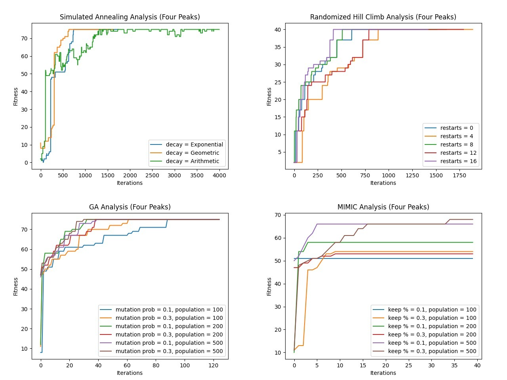
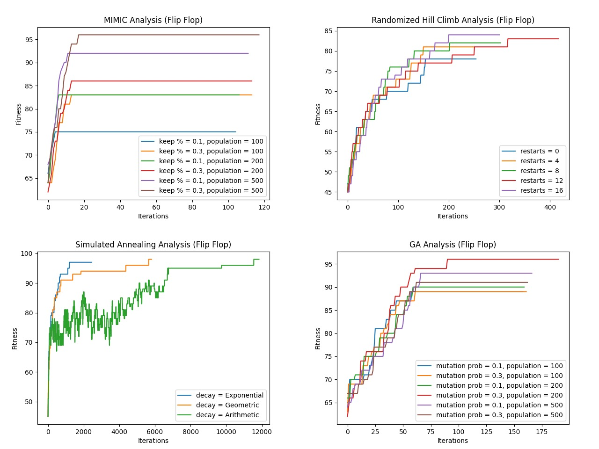
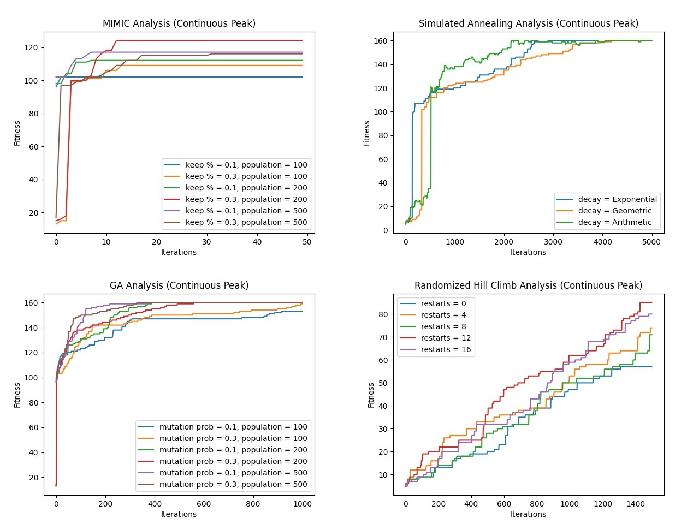

# Introduction, Implementation and Comparison of Four Randomized Optimization Algorithms

## Abstract

This study is mainly split into two parts:

1. Applying three randomnized optimization algorithms (randomnized hill climb, simulated annealing, genetic algorithm) to optimize the weights of a neural network on the Wisconsin Breast Cancer dataset.
2. Applied the above three algorithms together with the Mutual-Infotmation-Maximizing Input Clustering (MIMIX) to three classic optimization problems: the Four Peaks Problem (FPP), the Flip Flop Problem (FFP) and the Contiuous Peak Problem (CPP).

As a result, the structure of this reports is as follows:

1. Introduction to Four Randomized Optimization Algorithms
2. Neural Network Weight Optimization
3. Three Classic Optimization Problems
4. Conclusion

### 1. Introduction of the four randomized optimization algorithms

#### 1.1 Randomized Hill Climbing (RHC)

Randomnized Hill Climbing can be summarized as the classic Hill Climbing with restarts at random place of the input space. Hill Climbing is a mathematical optimization technique which starts with a random solution to the problem and continues to find a better solution by incremental change e.g. gradient descent until an optimum is found. RHC does this multiple times and each time with a different random initial position. The advantage of this algorithm is that it uses very little memory. The disadvantage of it is that it's still prone to be stuck in local optima since the randomness of the initial guess can not guarantee a comprehensive cover of the input space. Classic optimization problems such as FPP will exagerrate this downside as we will see later.

### 1.2 Simulated annealing (SA)

Simulated Annealing is an iterative procedure that continuously updates one candidate solution until a termination condition is reached. One can find its root in metalurgy where a piece of metal is heated up to form a speicific shape and cooled down into a minimum-energy crystalline structure that alters the molecule structures. Similarly, SA introduces the concept of Temperature to the optimization process. The higher the temperature, the more likely the algorithm will accept a worse solution, encouraging exploring. The lower the temperature, the less likely the algorithm will accept a worse solution, encouraging exploitation. The algorithm starts with a high temperature and gradually decreases the temperature until the termination condition is reached. The advantage of this algorithm is that it's more likelt to escape local optima than RHC. The disadvantage of it is that it's computationally expensive and requires a lot of memory.

### 1.3 Genetic algorithm (GA)

A genetic algorithm is an iterative procedure that maintains a population of individuals which are candidate solutions to the problem being solved. During each iteration or generation, each individual of the current population is rated for its effectiveness or fitness. Based on these ratings a new population of candidate solutions is formed using specific genetic operators such as cross-over and mutation to replace the population that has been deemed unfit. The loop will keep on going until the termination condition is reached. The advantage of this algorithm is that due to mutation and corss-over, it can explore the input space and find solutions that local search algorithms struggles to find. The disadvantage of it is that it's computationally expensive and may not be a suitable option for complex problems since it's metaheuristic.

### 1.4 Mutual-Information-Maximizing Input Clustering (MIMIC)

MIMIC is an iterative procdure that solves the optimization problem through probablity distribution estimates and converying structural information from the current iteration to the next. It first randomly samples from those regions of the input space most likely to contain the optima. Then it uses the instances that has a fitness score higher than the median to estimate the probability distribution for the next cycle. The algorithm will then set the fitness threshold to the median and sample a new set of instances using that probability distribution and repeat the process until the optima is found. The advantage of this algorithm is that it's computationally efficient and can be applied to complex problems. The disadvantage of it is that it's highly dependant on the way the probability distribution is estimated and how the hyper parameters are tuned.

## 2. Part I: Neural network weights optimization

### 2.1 Dataset selection and preprocessing

This dataset is from [UCI Machine Learning Repository](https://archive-beta.ics.uci.edu/ml/datasets/breast+cancer+wisconsin+diagnostic).

This dataset is relatively small with only 569 rows. According to the description, the data can be seperated by a plane in the 3-dimensional space with the Multisurface Method-Tree. It will be interesting to see how this property affect the classifiers performance.

The dataset is relatively balanced with 357 benign and 212 malignant cases. The data is linearly seperable with a plane in the 3-dimensional space. The data is also normalized.

The dataset is partitioned into 80% training and 20% testing sets. In this part, three randomized optimization algorithms (randomized hill climbing, simulated annealing, and genetic algorithm) will be applied to optimize the weights of the neural network and compare with the ones obtained using backpropagation.

### 2.2 Implementation of randomized optimization algorithms

## 3. Part II: Implementation of four algorithms in three problems

### 3.1 Four Peak Problem (FPP)

FPP is a problem with two global optima and two local optima with wide "basins of attraction". It is designed to capture the weakness of RHC and SA for which the chance of finding the global optima is highly dependant on the distribution of the optima. The more robust mathematical representation of the problem can be found in Section 6.1 of _Randomized Local Search as Successive Estimation of Probability Densities_[1] by _Chales L. Isbell Jr. et al._

The most straight forward criteria of comparison is fitness versus iterations. Figure 3.1.1 shows the relationship of fitness and iterations on a FPP that has a problem size of 100 over 10000 iterations across all 4 algorithms. There's a huge performance difference between RHC/SA and GA/MIMIC. GA and MIMIC are able to achieve their maximum fitness (a.k.a optima) within 1000 iterations but SA and RHC take a lot longer and the optima it achieved is not global optima since it's lower than the optima GA and MIMIC have achieved. This really depictst the problem the FPP problem is trying to capture, namely two global optima and two local optima with wide "basins of attraction" where the SA and RHC algorithms are clearly falling into.

Another observation is that although MIMIC gets to a better optima, it still hasn't achieved the same optima GA has reached. One suspision is the probability distribution estimate function that the MIMIC algorithm is using does not capture the sample distirbution well considering that only a very few percentage of the input spaces corresponds to the global optima. This situation may be mitigated if the `max_attempts` parameter i increased so that MIMIC can take time to get out of the realtively better local optima.

Figure 3.1.2 plotted the four algorithms with different hyperparameters. For SA and RHC, the hyperprameter tuning doesn't seem to be really taking effect most likely due to the property of the FPP, although for RHC, a higher number of restarts does seem to be decreasing the iterations it took to reach its optimum. For GA, although it took around the same iterations to achieve the optimum, the fitness is a lot better at iteration 0 with a higher mutation probability and a larger population. This is likely due to the fact that a higher probablity of mutation encourages more exploitation and a larger population size means a higher chance to have godd fitness individuals. For MIMIC, the same pattern as GA can be observed. The fitness score at iteration 0 is lot higher when the population is larger and the kept-percentage is higher. This is likely due to the fact that a larger population size yields more samples and that helps the algorithm to make a better and more precise probability distribution estimate.

One interesting observation is that although in a broader point of view (e.g. large problem size), SA should have a worse optima found than the MIMIC/GA algorithm, SA actually performs as well as the MIMIC/GA algorithm here. It's likely due to the fact that the problem size is relatively smaller and SA has enough probability for exploring when the temperature is still high. This can also be observed from Figure 3.1.3 where the fitness vs. problem size graph for all 4 algorithms are plotted. SA performs better than RHC when the problem size is small but its performance plummeted when the problem size gets larger and eventually converges to the same curve RHC has.

Another important criteria that should be compared is time efficiency between the four algorithms. From Figure 3.1.4, the computation time of MIMIC seems to have an exponential relationship with the problem size and in machine learning expoenential means evil. SA and RHC seems to be taking constant time and GA is taking slightly longer but still constant time.

In conlcusion, considering the time efficiency and the effectiveness of the four algorithms, GA is the best algorithm to solve this kind of optimization problem. The time it took doesn't change too dramatically with the problem size and it yeilds some of the best if not the best optima in the input space.

### 3.2 Flip Flop Problem (FFP)

FFP is a problem that counts the number of times of bits alternation in a bit string. A maximum fitness bit string would be one that consists entirely of alternating digits. (i.e. 0b1010101010)

As in Figure 3.2.1, the fitness vs. iteration plot is first presented. GA and MIMIC algorithms are again close to each other. RHC, although finding the optima realtively quickly, is still stuck in the local optima where the fitness is much worse than MIMIC/GA. The SA algorithm performs similar to the MIMIC/GA algorithm within the first 2000 iterations but performs slightly better beyond that. This gain however, is being outweighed by the amount of iterations it takes to achieve.

Figure 3.2.2 plotted the four algorithms with different hyperparameters tuned. Just like in FPP, different tuning of the hyperparameters for RHC doesn't really make a difference. For SA, all 3 decay algorithms achieve the same optima but with different speed. Exponential decay achieves the optima with the last amount of iterations and arithmetic, the most. For GA, the optima with different hyperparameters achieved are similar, but from the graph, a mutation probability of 0.3 and population of 200 seems to do the best job. For MIMIC, it's clearly shown that with a higher population and a higher kept percentage, the better the result is. One surprising finding is how few iterations MIMIC takes to achieve the optima (20 iterations). This is likely due to the fact that the property of the FFP provides an easy-to-predict probability distribution and that gives the MIMIC algorithm an upper hand.

Last but not least, a computation time vs problem size graph is plotted. Similar pattern is observed compared to FPP, except that the computation time for GA increased significantly when the problem size gets larger. This is likely due to fact that too much cross-over nad mutation actually lowers the possibility for GA to find the optima.

In conlcusion, considering the time efficiency and the effectiveness of the four algorithms, MIMIC is the best algorithm to solve this kind of optimization problem. Relatively, it takes the shortest amount of time to yield the best result.

### 3.3 Continuous Peaks Problem (CPP)

CPP is a problem that contains many local optima. In a 2D world, a better solution can be found by moving to more positive or negative on the x-axis. However, in a high dimensional world, a better solution might be found in all directions at each dimension. Therefore, the difference between randomized optimization and no randomized optimization can be very evident if there are many local optima.

The first plot to look at is fitness vs iteration plot, as in Figure 3.3.1. This time, MIMIC performs a lot wose than GA. RHC is still stuck in the local optima where the fitness is much worse than MIMIC/GA with a huge margin. This is likely due to the increasing number of local optima which makes it harder to cover the whole input space only depending on randomness. The SA algorithm performs the best in this case. It's likely due to the fact that the SA algorithm is able to explore the input space more efficiently than the other algorithms and more peaks means that there's a higher possibility for SA to achieve the global optima.

The fitness vs iteration plot with hyperparameter tuning, as in Figure 3.3.2 reinforces the observation that GA and SA are performing better than MIMIC and RHC for CPP. For MIMIC, although the algorithm converges within very few iterations, the fitness is still much lower than GA and SA.

Although GA and SA can yield the same optima result, the time it took each algorithm to get there is very different. GA takes a lot longer than SA to achieve the same optima as shown in Figure 3.3.3. Compared to the time GA took, the SA can find the optima almost in an instant. This is likely due to the fact that GA is a lot more computationally expensive than SA, expecially when the problem is in higher dimension. Additionally, the plot in FIgure 3.3.4 shows that the SA algorithm can consistently yield the result that has the same quality as GA

In conclusion, SA is the best algorithm to solve this kind of optimization problem. It's able to find the optima in a very short amount of time and it's able to find the global optima in a high dimensional input space.

## 4. Conclusions
