# Unsupervised Learning and Dimensionality Reduction

## Abstract

In this analysis report, different clustering and dimensionality reduction algorithms will be used to pre-process the data to train neural network and comparison will be made according to the result gained from the supervised learning report. Two clustering algorithms were explored: K-Means and Expectation Maximization (EM) using Gaussian Mixture Model (GMM). Four dimensionality reduction methods were implemented: Principal Component Analysis (PCA), Independent Component Analysis (ICA), Random Projection (RP) and Extra Tree Classifier (ETC). The paper is structured in 3 main sections: Part 1 applies clustering to two datasets, Part 2 & 3 applies dimensionality and re-clustering to two datasets and Part 4 applies dimensionality and reclustering with neural networks.

## Datasets

### Wisconsin Breast Cancer

This dataset is from [UCI Machine Learning Repository](https://archive-beta.ics.uci.edu/ml/datasets/breast+cancer+wisconsin+diagnostic).

This dataset is relatively small with only 569 rows and 30 columns. According to the description, the data can be seperated by a plane in the 3-dimensional space with the Multisurface Method-Tree. It will be interesting to see if the cluserting algorithm can pick up this feature.

The dataset is also not balanced. There are 357 benign and 212 malignant cases. This may skew the result of clustering as it intinsically adds more weight to the majority class when computing interia for K-Means, for instance.

### Dry Bean

This dataset is from [UCI Machine Learning Repository](https://archive-beta.ics.uci.edu/ml/datasets/dry+bean+dataset).

The images of 13,611 grains of 7 different registered dry beans were taken with a high-resolution camera wtih a total of 16 features. From the paper related with the dataset, all different types of beans but the Barbuya kind all have white colors and the only visual queue that can help distinguishing them are some physical hints which sometimes are quite deceiving still to the human eyes. Because of this, it will be inteseting to see how feature selection can alter the number of columns while minimizing data loss.

According to the label distribution, the dataset is not perfectly balanced. It has a relatively low amount of data on Barunya and Bombay kind but a realtively high amount of data on Dermason kind. It will be interesting to see if that means Barunya and Bomaby will be categorized into the same label during clustering.

## Part 1: Clustering

### K-Means

K-Means is a simple clustering algorithm that is easy to implement and understand. It is also one of the most popular clustering algorithms. It is a centroid-based algorithm that tries to minimize the distance between the data points and the centroid of the cluster. The algorithm is as follows:

1. Randomly initialize K centroids
2. Assign each data point to the closest centroid
3. Update the centroid of each cluster
4. Repeat 2 and 3 until the centroids don't change

The algorithm is simple and easy to understand but it has some drawbacks. The algorithm is sensitive to the initial centroids and the algorithm does not guarantee to converge to a global minimum just like in the hill climbing problem.

To choose the optimal number of clusters, the elbow method is used. The elbow method is to plot the inertia (sum of squared distance between each data point and the centroid of the cluster) against the number of clusters. The number of clusters that has starts linear decrement in inertia is the optimal number of clusters. For this report, python library kneedle is used to determine the optimal number of clusters through the `KneeLocator` class.

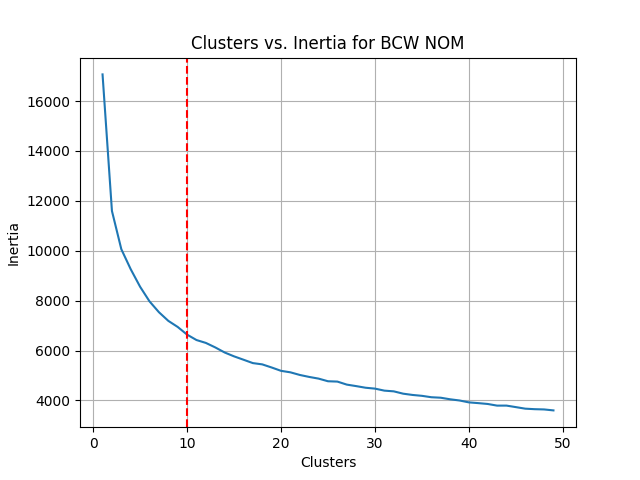 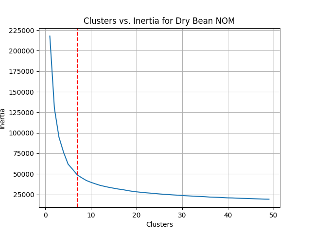

The two figures above (Figure 1.1 and Figure 1.2) are the intertia-cluster curve for BCW (Left) and Dry Bean (Right), the red dotted line is the optimal number of clusteres determined by `KneeLocator`. For BCW, that number is 10 and for Dry Bean, the optimal number of cluster is 7.

To visualizae how good the cluters are, silhoutte analysis is employed. It displays a measure of how close each point in one cluster is to points in the neighboring clusters and thus provides a way to assess parameters like number of clusters visually.

Silhouette coefficients (as these values are referred to as) near +1 indicate that the sample is far away from the neighboring clusters. A value of 0 indicates that the sample is on or very close to the decision boundary between two neighboring clusters and negative values indicate that those samples might have been assigned to the wrong cluster.[1]

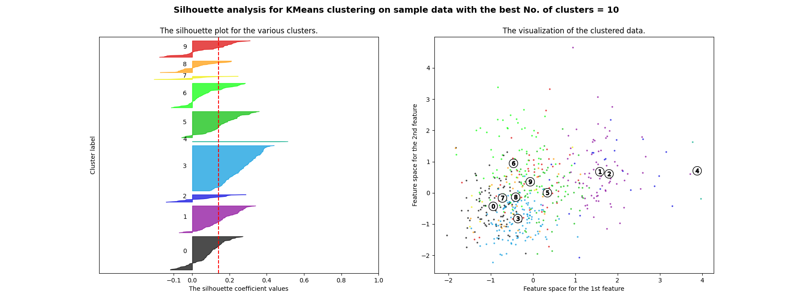

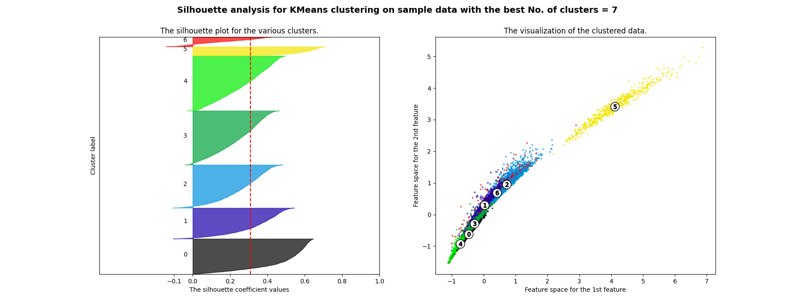

Figure 1.3 shows the siloutte analysis of K-Means Clustering for BCW and Figure 1.4 shows the siloutte analysis of K-Menas Clustering for Dry Bean.

For BCW, the result of K-Means Clstering is drastically different from what was expected. Initially, the dataset is categorized into 2 labels (benign and malicious). However, K-Means Clustering separated the dataset into 10 categories. According to the silhoutte score, there are a lot of uncertanties as well since there is a substantial amount of data point having negative silhoutte score. From the cluster visualization, it is not hard to see that the data points are very scattered out and are not forming 2 very obvious centroids which means the k-means algorithm is slower to converge making the intertia curve less "elbowy".

This hypothesis can also be backed up by what is shown from the dry bean dataset. The dry bean dataset is a lot more concentrated at the diagonal line of the first quadrant and separation of datapoints can be clearly observed (at least between group 5 and the rest). K-Means CLustering is also able to find the optimal number of clusters (7) equal to the original number of labels (7).

Since a diagram can only represent 2D coordinates, parallel coordinates visulization is also used to gain more insight into the dataset in higher dimensions.

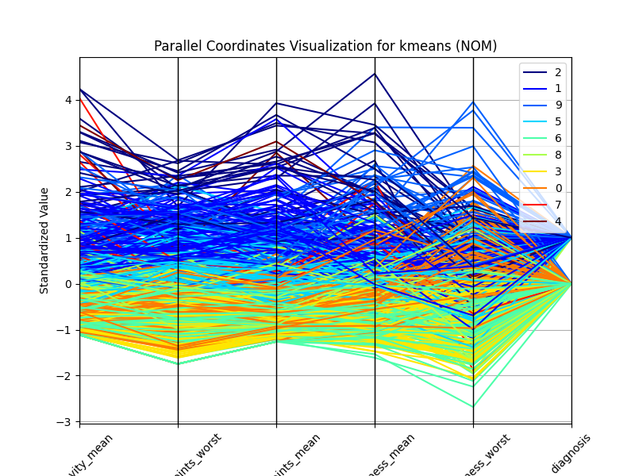

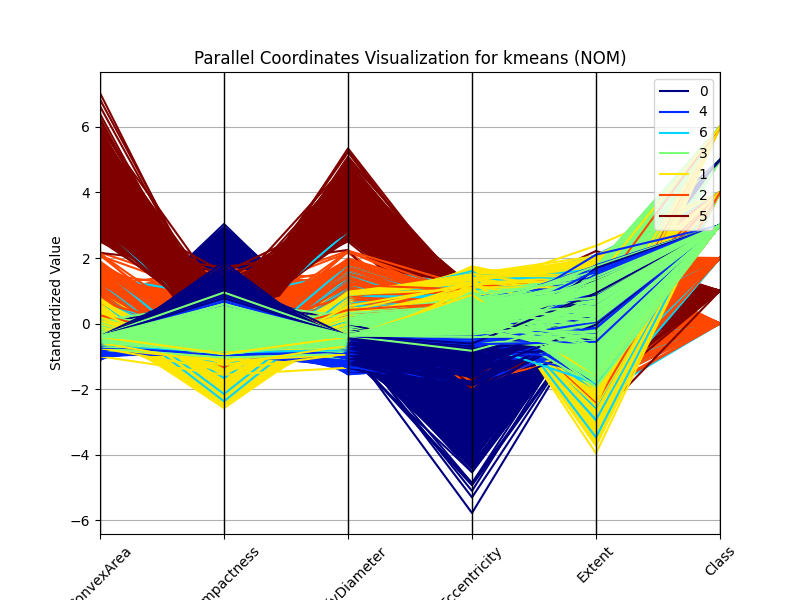

Figure 1.5 shows the parallel coordinates visualization of K-Means Clustering for BCW and Figure 1.6 shows the parallel coordinates visualization of K-Means Clustering for Dry Bean. From the BCW diagram, it is clear that the progression of features for a certain row is almost haphazard. Although two instance can have similar values on one feature, they can have very different values on the very next one features. This property makes it hard for K-Means Clustering to find the "proper" optimal number of clusters. The parallel coordinates visualization of K-Means Clustering for Dry Bean is a lot more directional.

One possible reason is that the dry bean dataset contains a lot more rows than BCW. With more data, the more likely centroids are formed statistically. Another reason can be that the features in the dry bean dataset is just a lot more representative of different categories resulting in a better clustering result.

### Expectation Maximization (EM) using Gaussian Mixture Model (GMM)

Expectation Maximization (EM) is an iterative algorithm that is used to find maximum likelihood or maximum a posteriori (MAP) estimates of parameters in statistical models. The algorithm is as follows:

1. Initialize the mean and covariance of each Gaussian
2. Repeat until convergence:
   1. E-step: Compute the posterior probability of each Gaussian for each data point
   2. M-step: Update the mean and covariance of each Gaussian

The algorithm is used to find the maximum likelihood of the parameters of a Gaussian Mixture Model. The algorithm is used to find the parameters of the Gaussian Mixture Model that maximizes the likelihood of the data.

To find the optimal number of clusters for GMM, Baysian Information Criterion (BIC) is introduced. This criterion gives us an estimation on how much is good the GMM in terms of predicting the data we actually have. The lower is the BIC, the better is the model to actually predict the data we have, and by extension, the true, unknown, distribution. In order to avoid overfitting, this technique penalizes models with big number of clusters.[2] As a result, if the BIC curve is monotonously decreasing, the optimal number of clusters is again the elbow of the curve but when the curve is not monotonous, the optimal number of clusters is the minimum of the curve.

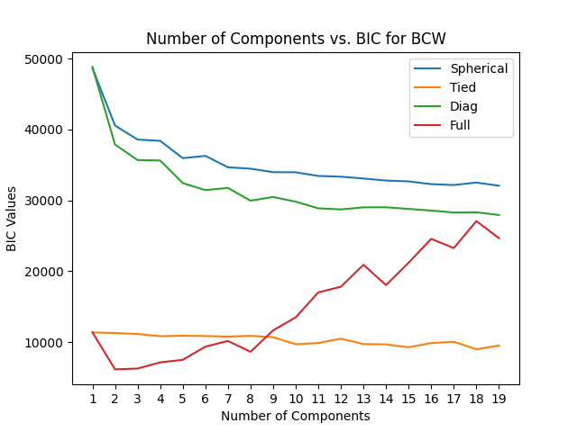 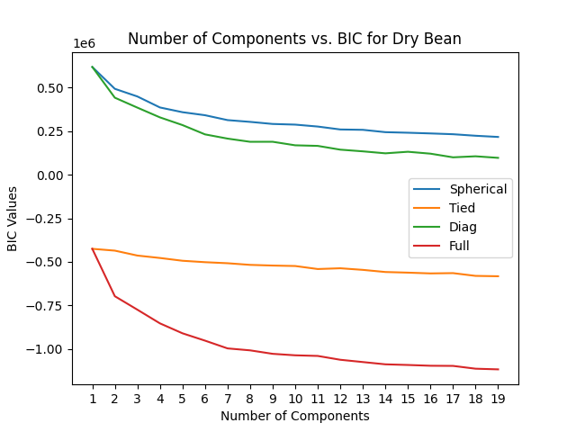

Figure 1.7 shows the BIC-cluster curve for BCW and Figure 1.8 shows the BIC-cluster curve for Dry Bean. The red dotted line is the optimal number of clusteres determined by `KneeLocator`. For BCW, that number is 2 and for Dry Bean, the optimal number of cluster is 7.

Compared to K-Means Clustering, Expectation Maximization algorithm deals with scattering data like BCW much better as it's able to separate the dataset into 2 categories as the default label does. This is largely due to the fact that it doesn't assign a definitive label for each instance but a probability of belonging to a certain cluster (or the probability of getting spawned from a certain Guassian distribution).

## Part 2: Dimensionality Reduction

### Principal Component Analysis (PCA)

Principal Component Analysis (PCA) is a dimensionality reduction algorithm that is used to reduce the dimensionality of a dataset while retaining most of the information. It is a linear transformation that is used to transform the data into a lower dimensional space. The algorithm is as follows:

1. Compute the covariance matrix of the data
2. Compute the eigenvectors and eigenvalues of the covariance matrix
3. Sort the eigenvalues in descending order and choose the first k eigenvectors
4. Construct a projection matrix W from the top k eigenvectors
5. Transform the data X onto the new subspace using W

One common way of selecting the number of components to be used is to set a threshold of exaplinend variance and then select the number of components that generate a cumulative sum of variance as close as possible to the threshold. For both datasets, the threshold is set to 90%. This means that the optimal number of components for BCW is 6 and for Dry Bean, 2.

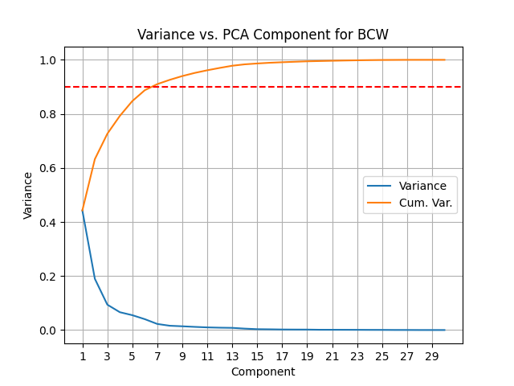 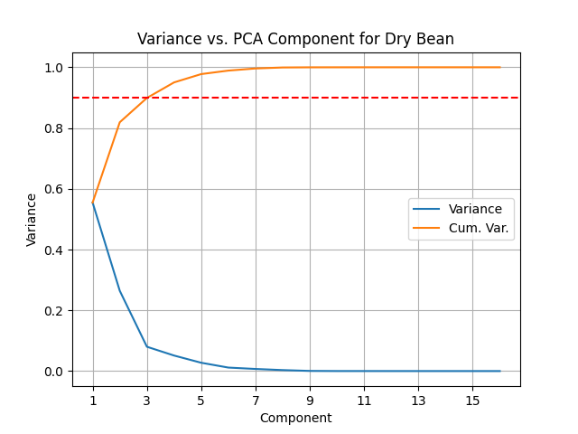

Figure 2.1 and Figure 2.2 shows the explained variance ratio of PCA for BCW and Dry Bean respectively. The red dotted line is the threshold of 90% explained variance. It is clear that more features are required to capture teh variance of BCW than Dry Bean. However, given how scattered the data is BCW, it's also likely the high vairance is just noise.

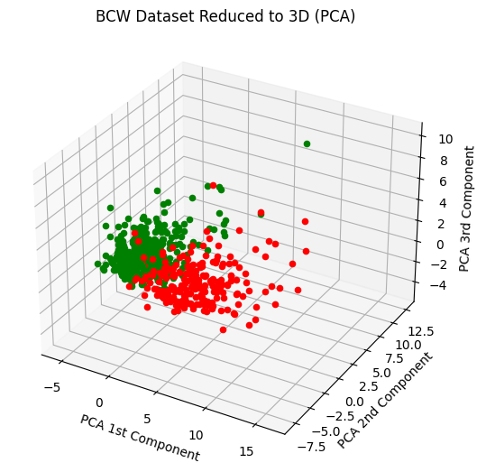 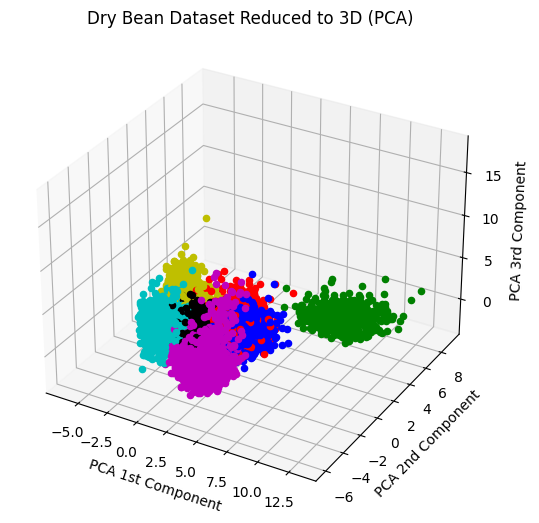

Figure 2.3 and Figure 2.4 shows the reduced dataset of PCA for BCW and Dry Bean respectively when the `n_component` hyperparameter is set to 3 for data visulization.

For BCW, overlapping of instances on the 1st principal component can still be observed which means K-Means is likely still going to have a hard time separating the data, but should perform better than the dataset without any feature selection as comparing the reduced dataset with the original feature of BCW, there is a more obvious clustering. This is likely due to the fact that only capturing 90% of the variance also filters out some outliers.

For Dry Bean, the data is a lot more concentrated and separation of instances can be observed clearly. One interesting finding is that compared to the scatter graph of the original feature set of Dry Bean (Figure 1.4), the general shape hasn't changed. There is one cluster that is to the dar top right corner of the PCA 1st Component & PCA 2nd Component quadrant and the other clusters are kind of concentrated in the bottom left corner of the quadrant. Given that 90% of the variance in the dataset is captured, it is likely that 15 out of the 17 features in the original dataset are just redundant information. With that said, it is safe to assume that the eignevector on the PCA 1st Component direction and on the PCA 2nd Component direction have a more significant magnitude compared to others. This can justify that it's a reasonable choice to project the data onto a lower dimensional space using PCA.

### Independent Component Analysis (ICA)

Independent Component Analysis (ICA) is a dimensionality reduction algorithm that is used to find independent components of a dataset. It is a non-linear transformation that is used to transform the data into a lower dimensional space.

Since the algorithm finds independent component through maximizinng independency and non-gaussianity, Kurtosis score is inntorduced to measure the non-gaussianity of the dataset and find the optimal number of components for this algorithm. In general, kurtosis score can be positive, 0, and negative, so the absolute value of the kurtosis score is used to measure how much is the distribution deviated from normal distribution.

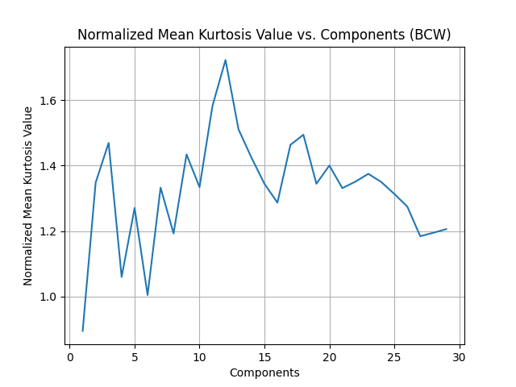 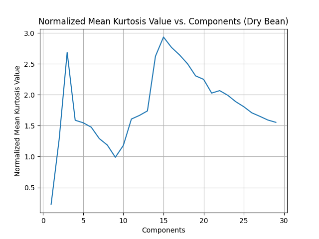

Figure 2.5 and Figure 2.6 shows the kurtosis score of ICA for BCW and Dry Bean respectively. For BCW, that number is 12 and for Dry Bean, the optimal number of components is 15.

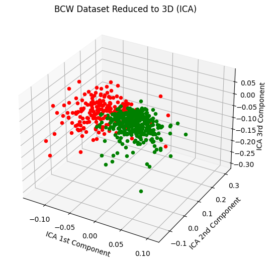 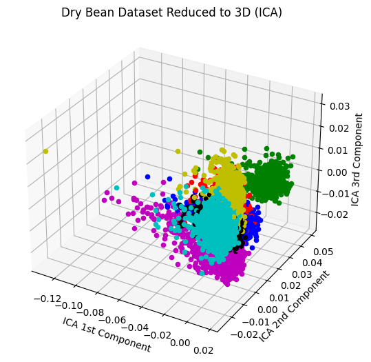

Figure 2.7 and Figure 2.8 shows the reduced dataset of ICA for BCW and Dry Bean respectively when the `n_component` hyperparameter is set to 3 for data visulization.

For BCW, similar behaviour is observed as in PCA.

For Dry Bean, the 3D visualization is almost like rotating the 3D visualization of PCA by 90 degrees. The clusters are still concentrated in the bottom left corner of the ICA 2nd Component and ICA 3rd Component quadrant. Theoratically, ICA should yield the same number of components as PCA (2), but in reality it doesn't. This is likely due to the noise in the dataset that is casuing overfitting as you can see on the ICA 1st Component axis and the Kutosis Score is very sensitive to outliers.

### Random Projection (RP)

Random Projection (RP) is a dimensionality reduction algorithm that is used to reduce the dimensionality of a dataset while retaining most of the information. It is a linear transformation that is used to transform the data into a lower dimensional space. The algorithm is as follows:

1. Construct a projection matrix W from a random Gaussian distribution
2. Transform the data X onto the new subspace using W

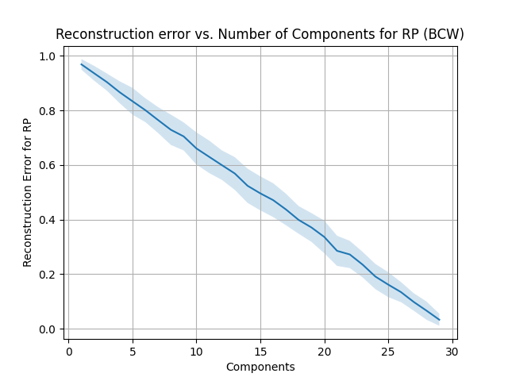 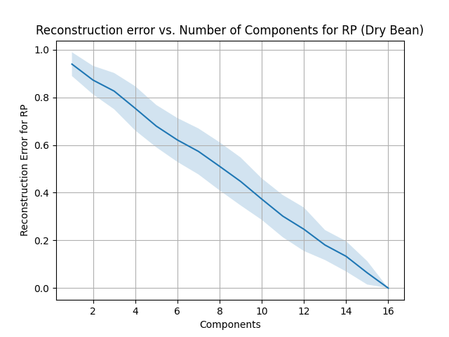

Since RP is purely randomly generating a projection matrix, there is no way to determine the optimal number of components. As a result, for this report, the number of components will be 50% of the original number of features. So that is 15 for BCW and 6 for Dry Bean.

From the graph, it is clear that the variance on the error curve of the Dry Bean dataset is higher than the one of BCW. This likely entails that there are only a few features in the original feature set are genuinely representative for Dry Bean. Essentially, when those features have a higher wieght on the projection matric, the error is lower. For BCW, however, the error is more consistent and the variance is lower. This likely entails that most columns in the original feature set of BCW are necessary to correctly represent an instance.

One thing to notice is that the number of instances in the BCW dataset and the Dry Bean dataset are not on the same order of magnitude. There are only around 600 instances in BCW and around 14,000 instances in Dry Bean. Since the resontruction error is a cumulative sum of the squared error of each instance, this means that the projection will deviate the instances in the BCW dataset more than the Dry Bean dataset.

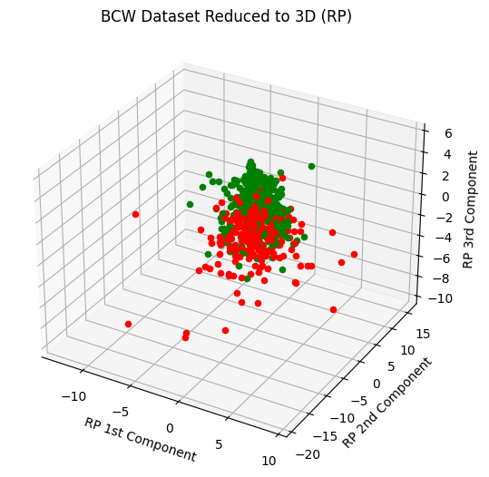 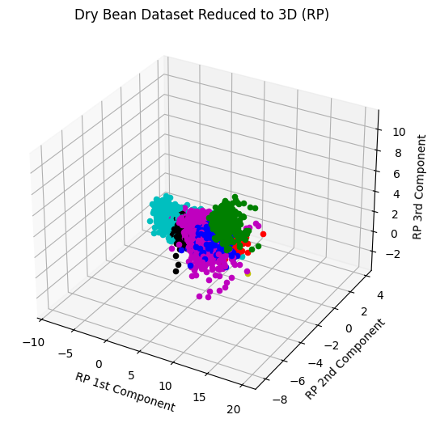

Figure 2.11 and Figure 2.12 shows the reduced dataset of RP for BCW and Dry Bean respectively when the `n_component` hyperparameter is set to 3 for data visulization.

So far, RP seems to be the worst feature selector. The centroids of the clusters are closer compared to other algorithms. This is, however, somewhat expected since there is not way to control the projection matrix and retain the most information like PCA and ICA does.

### Extra Tree Classifier (ETC)

Extra Tree Classifier (ETC) is a decision tree algorithm that is used to find the most important features of a dataset. It is a non-linear transformation that is used to transform the data into a lower dimensional space. The algorithm is as follows:

Repeat n times:

1. Construct a decision tree using a random subset of the features
2. Compute the importance of each feature

For this study, the mathematical criteria to determine importance is Gini Index and the maximum features is set to be the square root of the number of the origin feature sets. This means that the number of components for BCW is 6 and for Dry Bean, 4.

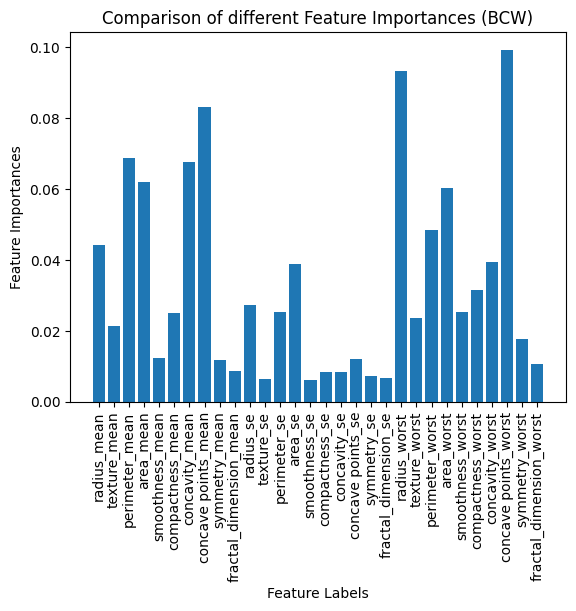 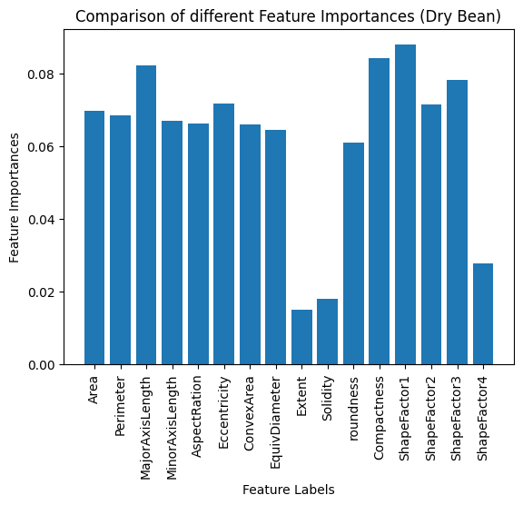

Figure 2.13 and Figure 2.14 shows the importance of ETC for BCW and Dry Bean respectively. For BCW, the most important features are `concave points_worst`, `concave points_mean`, `area_worst`, `area_mean`, `perimeter_worst`, and `perimeter_mean`. For Dry Bean, the most important features are `area`, `perimeter`, `compactness`, and `roundness`.

One insteresting find for the Dry Bean dataset is that there are multiple features that have the same level of importance. To some extent, this suggests that those features can be correlated and may be a linear combination of each other.

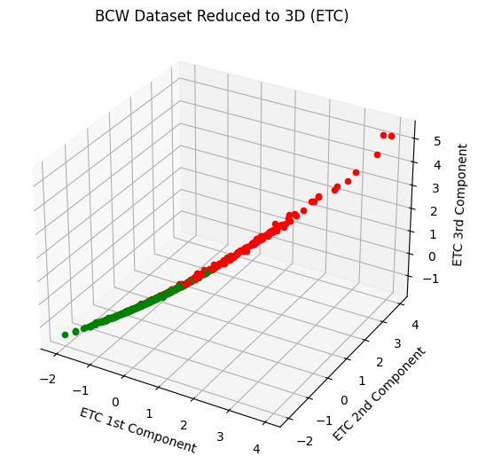 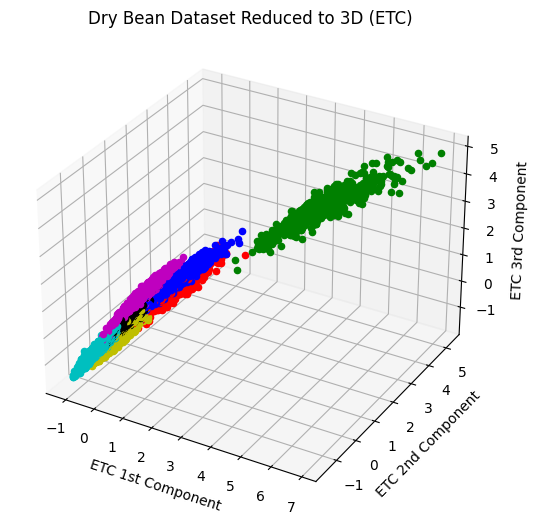

Since ETC doesn't change the feature set but just select the features that has the highest importance, the 3D visualization here can results in the scatter plot in Figure 1.3 and Figure 1.4 when being projected to a certain plane. For BCW, that will be the ETC 1st Component and ETC 3rd Component quadrant and for Dry Bean, that will be the ETC 2nd Component and ETC 3rd Component quadrant.

## Part 3: Clustering with Dimensionality Reduction

|                                   |  PCA   |  ICA   |   RP   |  ETC   | Normal |
| :-------------------------------: | :----: | :----: | :----: | :----: | :----: |
|    K-Means BCW No. of Clusters    |   9    |   15   |   9    |   6    |   10   |
|   K-Means BCW Silhouette Score    | 0.1867 | 0.0759 | 0.1495 | 0.3113 | 0.1416 |
| K-Means Dry Bean No. of Clusters  |   6    |   16   |   7    |   6    |   7    |
| K-Means Dry Bean Silhouette Score | 0.4578 | 0.1943 | 0.3453 | 0.4589 | 0.3094 |
|    EM(GMM) BCW No. of Clusters    |   4    |   5    |   3    |   6    |   2    |
|   EM(GMM) BCW Silhouette Score    | 0.1487 | 0.0295 | 0.3334 | 0.2241 | 0.3146 |
| EM(GMM) Dry Bean No. of Clusters  |   5    |   5    |   8    |   6    |   7    |
| EM(GMM) Dry Bean Silhouette Score | 0.4840 | 0.1430 | 0.2155 | 0.4530 | 0.3002 |

Table 3.1 shows the number of clusters and the silhouette score for K-Means and EM(GMM) for BCW and Dry Bean respectively. The silhouette score is calculated using the reduced dataset.

When the dataset yields a low silhoutte score or in another word does not show an obvious number of clusters like BCW, Expectation Maximization performances much better than K-Means whereas K-Means and EM(GMM) performs similarly when the silhoutte score is high. This is expected since K-Means can be interpreted as a special case of EM(GMM) where the covariance matrix is a diagonal matrix.

Comparing between the feature selection algorithms, it is surprising that ICA performs a lot worse than the other algorithms presented here. Figure 3.1 and Firue 3.2 shows the silhoutte analysis for Dry Bean after being reduced by PCA and ICA respectively. PCA concgregates the datapoints more towards the centroids, but ICA does exactly the opposite. The datapoints are more spread out and more overlaps can be found. This is likely due to fact that ICA finds independent component whereas PCA finds uncorrelated comoponents. The difference between independence and uncorrelation is that independence means that the components are not related at all whereas uncorrelation means that the components do not have a linear relationship. To some extent, ICA behaves like DFFT in signal processing where the waveform is transformed from the time domain to the frequency domain and noise can have an impact on the transformation result. As a result, ICA is more prone to overfit. One way to mitigate this problem is to add a mechanism that penalize large number of features.

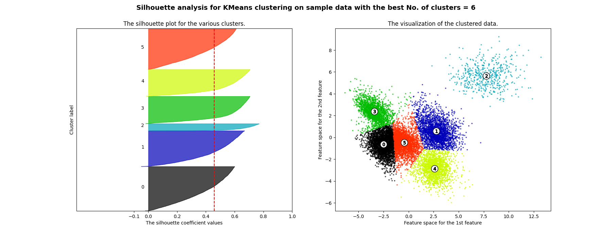

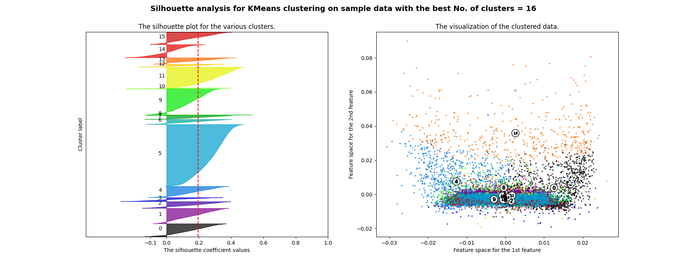

Another surprising finding is that ETC achieves better result for BCW than the other algorithms given that the algorithm doesn't transform the features but just select the most important features. This may remind one of the devil of dimensionality where more columns actually cause worse overfitting problems and provides sometimes contradicting information. Selecting features that has the highest gini index may drop those "useless" features and thus provides a better result.

## Part 4: Neural Network with Dimensionality Reduction and Clustering

|                   | K-Means | EM(GMM) |   PCA   |   ICA   |   RP    |   ETC   | Normal  |
| :---------------: | :-----: | :-----: | :-----: | :-----: | :-----: | :-----: | :-----: |
|   BCW Time (s)    | 263.10  | 146.17  | 259.99  | 409.15  | 248.55  | 270.18  | 217.42  |
|   BCW Accuracy    | 0.9825  | 0.9708  | 0.9708  | 0.9649  | 0.9825  | 0.9708  | 0.9883  |
| Dry Bean Time (s) | 1313.70 | 1377.41 | 1057.47 | 1971.78 | 1411.58 | 1493.68 | 1282.19 |
| Dry Bean Accuracy | 0.9312  | 0.9307  | 0.8702  | 0.9236  | 0.9305  | 0.9202  | 0.9336  |

Table 4.1 shows the time and accuracy for the neural network for BCW and Dry Bean respectively. 

In general, the accuracy across the 7 different configurations are similar. This fulfills the expectation of dimensionality reduction and clustering algorithms as the primary goal is to expedite the training process through reducing the curse of dimensionality. However, from the gathered data, training time isn't really shortened when training the neural network with dataset that has gone through either dimensionality reduction or clustering with the exception of EM(GMM) with BCW.

For ICA, the traininng time is significantly longer than the other algorithms. This is likely due to the fact that the dataset after ICA is more prone to overfitting as there will be more instances be deemed as outliers and thus requires more training time to converge as shown in Figure 3.2. This is also supported by the fact that the accuracy for ICA is lower than the other algorithms.

Another observation that is surprising is that PCA has a lower accuracy than all other algorithms. This is likely due to the fact that the PCA transformation only captures 90% of the variance here. This means that some information that can be necessary is lost during transformation given that the dimensionality did decrease from 17 to 2. The result may improve if the PCA threshold is set higher (e.g. 95%).

## Reference

- [1] https://scikit-learn.org/stable/auto_examples/cluster/plot_kmeans_silhouette_analysis.html
- [2] https://towardsdatascience.com/gaussian-mixture-model-clusterization-how-to-select-the-number-of-components-clusters-553bef45f6e4
